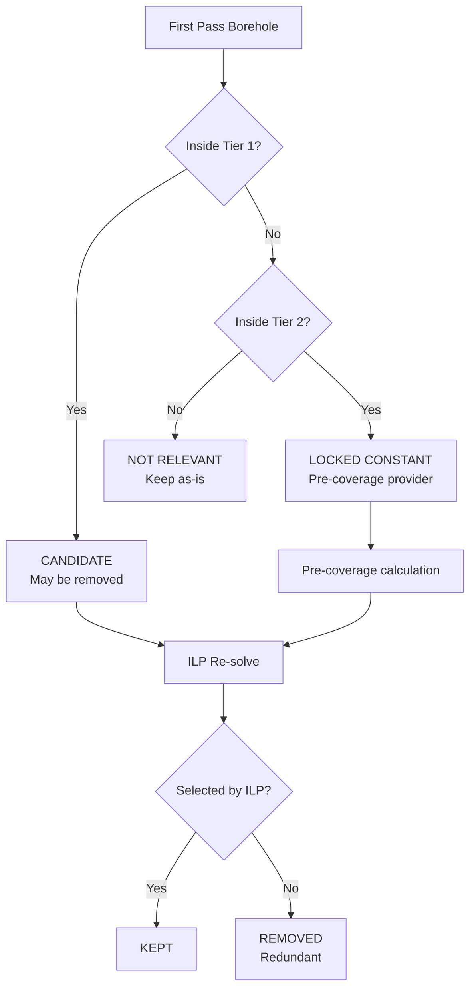
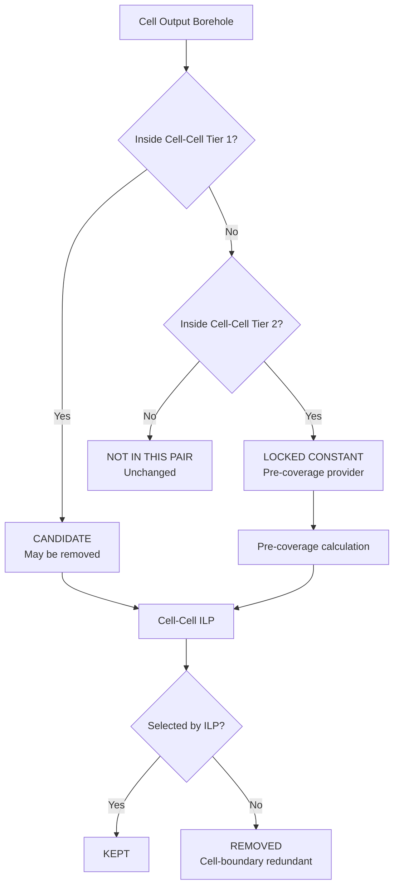
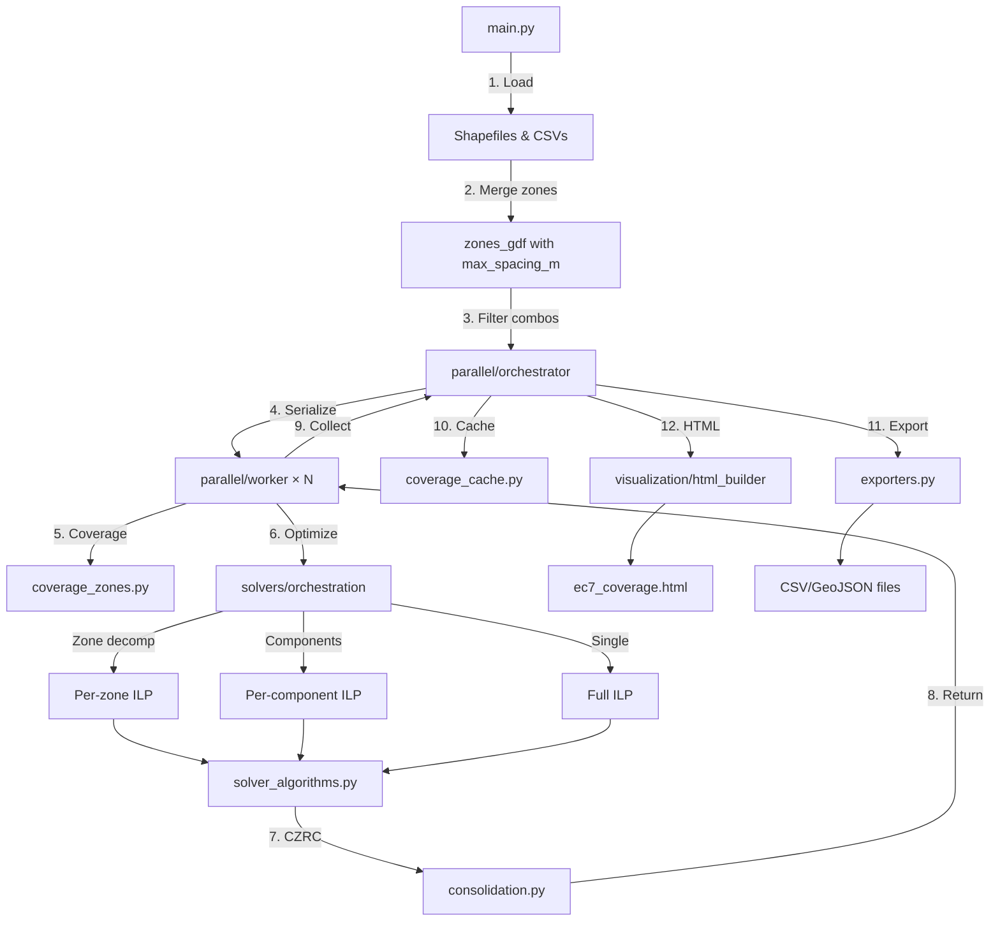

# Gap_Analysis_EC7

EC7-compliant borehole spacing analysis tool with interactive HTML visualization. Computes coverage zones, identifies gaps, and optimizes proposed borehole placements using ILP (Integer Linear Programming) and greedy algorithms.

---

## Quick Start

```bash
# From Embankment_Grid folder
python -m Gap_Analysis_EC7.main

# Or directly
python Gap_Analysis_EC7/main.py
```

Output: `Gap_Analysis_EC7/Output/ec7_coverage.html`

---

## 🎯 Three-Pass Optimization Architecture (CORE CONCEPT)

> **This is the most important section to understand.** The three-pass architecture is the heart of this program and determines how boreholes are selected.

### The Problem

EC7 requires boreholes spaced no more than `max_spacing_m` apart across investigation zones. Different zones may have different spacing requirements (e.g., Zone 1 = 100m, Zone 2 = 150m). The optimization goal is: **find the minimum number of boreholes that satisfy ALL test points across ALL zones.**

A **global optimization** (all zones simultaneously) produces the mathematically optimal solution but is computationally intractable for large problems (ILP solve time grows exponentially with test points).

**Solution:** Decompose the problem spatially using a three-pass approach:
1. **First Pass:** Solve per-zone independently
2. **Second Pass:** Consolidate redundancies at zone-zone boundaries (CZRC)
3. **Third Pass:** Consolidate redundancies at cell-cell boundaries within split clusters

---

### First Pass: Zone Decomposition

```
┌─────────────────────────────────────────────────────────────────────────────┐
│                           FIRST PASS: Per-Zone ILP                          │
│                                                                             │
│  ┌──────────────┐      ┌──────────────┐      ┌──────────────┐              │
│  │   Zone 1     │      │   Zone 2     │      │   Zone 3     │              │
│  │   R = 100m   │      │   R = 150m   │      │   R = 100m   │              │
│  │              │      │              │      │              │              │
│  │  ●  ●  ●     │      │    ●    ●    │      │  ●  ●  ●     │              │
│  │  ●  ●  ●     │      │              │      │  ●  ●  ●     │              │
│  │  ●  ●  ●     │      │    ●    ●    │      │  ●  ●  ●     │              │
│  └──────────────┘      └──────────────┘      └──────────────┘              │
│                                                                             │
│  Each zone solved independently → Optimal within zone, but ignores         │
│  cross-zone coverage opportunities                                          │
└─────────────────────────────────────────────────────────────────────────────┘
```

**First pass characteristics:**
- Splits gaps by zone boundaries using `zones_gdf`
- Solves ILP **independently per zone** with zone-specific `max_spacing_m`
- Each borehole gets `coverage_radius` = zone's `max_spacing_m`
- **Trade-off:** 5-15% more boreholes than global optimum

**Why the trade-off exists:**
A borehole near Zone 1/Zone 2 boundary could potentially cover test points in BOTH zones. First pass doesn't see this opportunity because it solves zones in isolation.

**Code path:**
```
solver_orchestration.py:optimize_boreholes()
  → _optimize_by_zone_decomposition()
    → For each zone:
        solver_algorithms.py:_solve_ilp()
    → aggregate_solution()
```

---

### Architecture Overview (All Three Passes)

```
┌─────────────────────────────────────────────────────────────────────────────┐
│                     COMPLETE THREE-PASS ARCHITECTURE                         │
│                                                                              │
│  FIRST PASS           SECOND PASS              THIRD PASS                   │
│  (Zones)              (Zone CZRC + Cells)      (Cell CZRC)                  │
│  ───────────          ──────────────────       ───────────                  │
│                                                                              │
│  ┌────┐ ┌────┐        ┌────────────────┐       ┌──────────────────┐         │
│  │ Z1 │ │ Z2 │  ──►   │ Zone CZRC      │  ──►  │ Cell CZRC        │         │
│  └────┘ └────┘        │ (cloud ∩)      │       │ (same algorithm) │         │
│                       │                │       │                  │         │
│                       │   IF > 1 km²:  │       │ For each cell:   │         │
│                       │   ┌────┬────┐  │       │ 1. Coverage cloud│         │
│                       │   │ C1 │ C2 │  │       │ 2. Pairwise ∩    │         │
│                       │   ├────┼────┤  │       │ 3. Tier 1/2      │         │
│                       │   │ C3 │ C4 │  │       │ 4. ILP solve     │         │
│                       │   └────┴────┘  │       │                  │         │
│                       │                │       │ C1∩C2, C1∩C3,    │         │
│                       │   Per-cell ILP │       │ C2∩C4, C3∩C4...  │         │
│                       └────────────────┘       └──────────────────┘         │
│                                                                              │
│  OUTPUT:              OUTPUT: Per-cell         OUTPUT: Cell-boundary        │
│  Zone-optimized       boreholes                optimized boreholes          │
│  boreholes            (zone boundaries         (cell boundaries             │
│                       consolidated)            consolidated)                │
└─────────────────────────────────────────────────────────────────────────────┘
```

---

### Second Pass: Cross-Zone Redundancy Check (CZRC)

The second pass identifies and removes boreholes that became redundant due to cross-zone coverage opportunities.

```
┌─────────────────────────────────────────────────────────────────────────────┐
│                          SECOND PASS: CZRC Consolidation                    │
│                                                                             │
│                    Zone 1                    Zone 2                         │
│               ┌──────────────────┬──────────────────┐                       │
│               │                  │                  │                       │
│               │      Interior    │    Interior      │                       │
│               │      (LOCKED)    │    (LOCKED)      │                       │
│               │                  │                  │                       │
│               │    ╔════════════════════════╗       │                       │
│               │    ║                        ║       │                       │
│               │    ║   CZRC REGION          ║       │                       │
│               │    ║   (Cloud intersection) ║       │                       │
│               │    ║                        ║       │                       │
│               │    ╠════════════════════════╣       │                       │
│               │    ║   Tier 1 (Active)      ║       │                       │
│               │    ║   Re-optimize here     ║       │                       │
│               │    ╠════════════════════════╣       │                       │
│               │    ║   Tier 2 (Context)     ║       │                       │
│               │    ║   Locked coverage      ║       │                       │
│               │    ╚════════════════════════╝       │                       │
│               │                  │                  │                       │
│               └──────────────────┴──────────────────┘                       │
│                                                                             │
└─────────────────────────────────────────────────────────────────────────────┘
```

---

### The CZRC Tier System (CRITICAL)

CZRC uses a **two-tier architecture** to efficiently re-optimize zone boundary regions:

#### Tier 1: Active Optimization Region (`CZRC + 1 × R_max`)

```python
tier1_region = czrc_region.buffer(tier1_mult * r_max)  # tier1_mult = 1.0
```

**What happens in Tier 1:**
- First-pass boreholes inside Tier 1 become **CANDIDATES** (may be removed)
- Fresh hexagonal grid candidates are generated inside Tier 1
- ILP re-solves with ALL candidates (first-pass + new grid)
- Test points from first-pass inside Tier 1 are **included in ILP constraints**

**Why Tier 1 = CZRC + 1×R_max:**
Any borehole within R_max of the CZRC region could potentially cover test points on either side of the zone boundary. This is the minimum region where cross-zone coverage is possible.

#### Tier 2: Coverage Context Region (`CZRC + 2 × R_max`)

```python
tier2_region = czrc_region.buffer(tier2_mult * r_max)  # tier2_mult = 2.0
```

**What happens in Tier 2:**
- First-pass boreholes in Tier 2 (but outside Tier 1) become **LOCKED CONSTANTS**
- Locked boreholes provide **pre-coverage** for test points they already satisfy
- Sparse test points are generated in the Tier 2 ring to prevent orphaning coverage

**Why Tier 2 = CZRC + 2×R_max:**
A test point at the edge of Tier 1 could be covered by a borehole at distance R_max, which itself could be at the edge of Tier 2. This ensures all coverage interactions are captured.

**Visual explanation:**
```
                            │
       Zone A               │               Zone B
                            │
    [Locked BH]             │             [Locked BH]
         │                  │                  │
         │  covers →  ┌─────┼─────┐  ← covers  │
         │            │  TP │ TP  │            │
         └────────────│─────●─────│────────────┘
                      │     ↑     │
                      │  Could be │
                      │  satisfied│
                      │  by EITHER│
                      │  locked BH│
                      └───────────┘
                       
  Legend:
    BH = Borehole
    TP = Test Point
    Locked BH = Tier 2 borehole (not re-optimized)
```

---

### Coverage Cloud Computation

The CZRC region is computed mathematically, not by arbitrary buffer distances:

```python
# For each zone, compute "coverage cloud" = union of all possible coverage circles
def compute_zone_coverage_cloud(zone_geometry, max_spacing_m, grid_spacing):
    test_points = generate_hexagonal_grid(zone_geometry, grid_spacing)
    coverage_circles = [pt.buffer(max_spacing_m) for pt in test_points]
    return unary_union(coverage_circles)

# CZRC region = intersection of coverage clouds from adjacent zones
czrc_region = cloud_zone_a.intersection(cloud_zone_b)
```

**The intersection represents exactly where a borehole could satisfy test points from BOTH zones.** This is mathematically rigorous, not heuristic.

**Key formula:**
```
For test points TP_A (Zone A, spacing R_A) and TP_B (Zone B, spacing R_B):
A single borehole can cover both IFF: distance(TP_A, TP_B) < R_A + R_B
This is geometrically equivalent to: coverage_cloud_A INTERSECTS coverage_cloud_B
```

---

### Borehole Classification Flow



---

### Variable Radius Coverage (CRITICAL GOTCHA)

**⚠️ AI frequently gets this wrong.**

In second pass, test point coverage uses the **test point's required radius**, NOT the borehole's original radius:

```python
# WRONG ❌
def can_cover(borehole, test_point):
    return distance(borehole, test_point) <= borehole.coverage_radius

# CORRECT ✅  
def can_cover(borehole, test_point):
    return distance(borehole, test_point) <= test_point.required_radius
```

**Why this matters:**
- Zone A test point (100m requirement) near Zone B borehole (150m original radius)
- The Zone B borehole CAN cover the Zone A test point (if within 100m)
- But the coverage distance is 100m (Zone A's requirement), not 150m

This is implemented in `consolidation.py:_compute_locked_coverage()` and `_build_coverage_dict_variable_test_radii()`.

---

### Second Pass Output

The second pass returns:
- `consolidated_boreholes`: Final list after removing redundancies
- `removed_boreholes`: Boreholes eliminated (shown in visualization with red X markers)
- `added_boreholes`: New boreholes added during CZRC (usually few, if any)
- `consolidation_stats`: Per-zone statistics

**Typical results:**
- First pass: 150 boreholes (zone-by-zone optimal)
- After CZRC: 140 boreholes (10 removed as redundant)
- Savings: ~7% reduction from cross-zone optimization

---

### When Second Pass is Skipped

CZRC is skipped when:
1. `czrc_optimization.enabled = False` in CONFIG
2. Only one zone exists (no boundaries to consolidate)
3. CZRC regions are empty (zones too far apart for cross-coverage)
4. Tier 1 contains no candidates (all boreholes are interior-locked)

---

### ⚠️ DEPRECATED: Border Buffer Strip Consolidation

> **Important for AI:** There is a **deprecated second-pass system** still present in the codebase. Do NOT use or extend this system—it will be removed.

#### What is Border Buffer Strip?

The old system (`border_consolidation` in CONFIG) used a simpler approach:

```python
# OLD APPROACH (DEPRECATED) - in consolidation.py:consolidate_boreholes_buffer_zone()
buffer_region = zone_boundaries.buffer(buffer_width_factor * max_spacing)
# ↑ Arbitrary buffer, doesn't consider actual coverage geometry
```

**Problems with border buffer strip:**
1. **Only works for physically adjacent zones** — If zones don't share a boundary, no consolidation happens
2. **Arbitrary buffer width** — `buffer_width_factor` is heuristic, not mathematically derived
3. **No coverage cloud intersection** — Doesn't identify where cross-zone coverage is actually possible
4. **Misses diagonal/non-adjacent opportunities** — Two zones across a third cannot be consolidated

#### CZRC vs Border Buffer Comparison

| Aspect                    | Border Buffer (DEPRECATED)                             | CZRC (RECOMMENDED)                             |
| ------------------------- | ------------------------------------------------------ | ---------------------------------------------- |
| **Mathematical basis**    | Arbitrary buffer distance                              | Coverage cloud intersection                    |
| **Zone adjacency**        | Required (shared boundary)                             | Not required (any overlapping clouds)          |
| **Buffer computation**    | `buffer_width_factor × max_spacing`                    | Tier 1 = CZRC + R_max, Tier 2 = CZRC + 2×R_max |
| **Test point source**     | Generated in buffer strip                              | Reused from first pass + sparse Tier 2 ring    |
| **Multi-spacing support** | Limited (uses max)                                     | Full (per-test-point required_radius)          |
| **Code location**         | `consolidation.py:consolidate_boreholes_buffer_zone()` | `czrc_solver.py:run_czrc_optimization()`       |

#### Current State

The border buffer system is controlled by:
```python
CONFIG = {
    "border_consolidation": {
        "mode": "disabled",  # or "buffer_zone", "ilp"
        # ... other settings
    }
}
```

**This entire section will be removed.** The replacement is:
```python
CONFIG = {
    "czrc_optimization": {
        "enabled": True,  # Master toggle for CZRC
        # ... tier settings
    }
}
```

#### Migration Plan

1. **Phase 1 (current):** Both systems coexist; CZRC is recommended
2. **Phase 2:** Deprecation warnings added to `consolidate_boreholes_buffer_zone()`
3. **Phase 3:** `border_consolidation` CONFIG section removed
4. **Phase 4:** `consolidate_boreholes_buffer_zone()` deleted from `consolidation.py`

**AI developers:** When modifying second-pass logic, work in `czrc_solver.py` and `czrc_geometry.py`, NOT `consolidation.py:consolidate_boreholes_buffer_zone()`.

---

### Code Path Summary

```
First Pass:
  solver_orchestration.py:optimize_boreholes()
    → _optimize_by_zone_decomposition()
      → solver_algorithms.py:_solve_ilp() [per zone]
    
Second Pass (if enabled):
  solver_orchestration.py:optimize_boreholes()
    → consolidation.py:run_czrc_optimization()
      → czrc_geometry.py:compute_czrc_consolidation_region()
      → czrc_solver.py:check_and_split_large_cluster()
        → IF area > 1 km²: split cells → solve each cell → THIRD PASS
        → ELSE: solve_czrc_ilp_for_cluster() directly
      → czrc_solver.py:solve_czrc_ilp_for_cluster() [per cluster/cell]
        → compute_czrc_tiers()
        → classify_first_pass_boreholes()
        → filter_test_points_to_tier1()
        → _compute_locked_coverage()
        → _solve_ilp() [reusing existing solver]
      → aggregate_czrc_results()

Third Pass (if cluster was split):
  czrc_solver.py:check_and_split_large_cluster()
    → After cell processing, IF cell_boundary_consolidation.enabled:
      → run_cell_czrc_pass()
        → detect_cell_adjacencies()           # Coverage cloud intersections
        → FOR each adjacent cell pair:
          → solve_cell_cell_czrc()            # Same tier/ILP pattern
        → Merge removed/added across all pairs
```

---

### Configuration for Three-Pass

```python
CONFIG = {
    "ilp_solver": {
        "use_zone_decomposition": True,   # Enable first pass zone splitting
        "stall_detection": {
            "enabled": True,               # Early termination on solver stall
            "gap_threshold_pct": 15.0,     # Only trigger if gap > 15%
            "warmup_seconds": 15.0,        # Wait before checking for stalls
            "apply_to_czrc": True,         # Also apply to CZRC second/third pass
        },
    },
    "czrc_optimization": {
        "enabled": True,                   # Enable second pass CZRC
        "skip_ilp": False,                 # True = visualization only (no ILP)
        "tier1_rmax_multiplier": 1.0,      # Tier 1 = CZRC + 1×R_max
        "tier2_rmax_multiplier": 2.0,      # Tier 2 = CZRC + 2×R_max
        "tier2_test_point_protection": {
            "enabled": True,               # Generate sparse Tier 2 test points
            "tier2_test_spacing_multiplier": 3.0,  # 3× sparser than Tier 1
        },
        "cell_splitting": {
            "enabled": True,               # Split large regions into cells
            "max_area_for_direct_ilp_m2": 1_000_000,  # 1 km² threshold
            "method": "kmeans_voronoi",    # K-means + Voronoi (default)
            "min_cell_area_m2": 100,       # Skip tiny slivers
        },
        # ═══════════════════════════════════════════════════════════════════
        # 🔗 THIRD PASS: CELL-CELL BOUNDARY CONSOLIDATION
        # ═══════════════════════════════════════════════════════════════════
        "cell_boundary_consolidation": {
            "enabled": True,               # Master switch for third pass
            "tier1_rmax_multiplier": 1.0,  # Same as zone CZRC
            "tier2_rmax_multiplier": 2.0,  # Same as zone CZRC
            "test_spacing_mult": 0.2,      # Test point density
        },
        "cache_enabled": False,            # Intra-run CZRC result caching
    },
}
```

---

### 🔲 Cell Splitting (Large Region Decomposition)

When CZRC regions exceed 1 km², they are split into smaller cells to prevent ILP solver stalls. Two methods available:

- **K-means + Voronoi (default):** Balanced cells following candidate density. Set `"method": "kmeans_voronoi"` in config.
- **Grid (legacy):** Fixed 2km × 2km grid. Set `"method": "grid"` in config.

Cell boundaries appear as orange dotted lines in HTML (CZRC Grid checkbox). See `czrc_solver.py` for implementation.

---

### Third Pass: Cell-Cell CZRC Boundary Consolidation

The third pass applies the **exact same CZRC algorithm** to cell-cell boundaries that the second pass applies to zone-zone boundaries. This is a recursive application of the proven CZRC approach.

#### Third Pass Visualization Definitions

| Term                 | Definition                                                                                                                                                                       |
| -------------------- | -------------------------------------------------------------------------------------------------------------------------------------------------------------------------------- |
| **Grey Markers**     | Second Pass OUTPUT boreholes (First Pass survivors + Second Pass additions) that fall within Third Pass **Tier 1**. These are candidates for re-optimization and may be removed. |
| **Locked Boreholes** | Second Pass OUTPUT boreholes that fall within Third Pass **Tier 2** (but outside Tier 1). These provide coverage context but are NOT re-optimized - treated as fixed constants.  |
| **Red X Markers**    | Boreholes that were in Third Pass Tier 1 (grey markers) but were removed by Third Pass ILP.                                                                                      |
| **Blue Markers**     | Boreholes that survived Third Pass (either were locked in Tier 2, or were selected by ILP in Tier 1).                                                                            |

**Key Point:** Grey markers show the INPUT to Third Pass re-optimization within the Tier 1 area. If a borehole was not in Third Pass Tier 1, it was locked and not subject to removal.

---

#### The Cell Boundary Problem

When the second pass splits large CZRC regions into Voronoi cells (via K-means clustering), each cell is solved independently. This creates the **same over-provisioning problem** that exists between zones:

```
┌─────────────────────────────────────────────────────────────────────────────┐
│           CELL BOUNDARY PROBLEM (IDENTICAL TO ZONE BOUNDARY PROBLEM)         │
│                                                                              │
│     Cell A (Voronoi)              Cell B (Voronoi)                          │
│     ┌────────────────┐           ┌────────────────┐                         │
│     │                │           │                │                         │
│     │   Solved       │           │   Solved       │                         │
│     │   independently │           │   independently │                         │
│     │                │           │                │                         │
│     │   ●  ●  ●  ●   │           │   ●  ●  ●  ●   │                         │
│     │   ●  ●  ●  ●   │           │   ●  ●  ●  ●   │                         │
│     │   ●  ●  ●  ● ──┼───────────┼── ●  ●  ●  ●   │                         │
│     │   ●  ●  ●  ●   │           │   ●  ●  ●  ●   │                         │
│     │                │           │                │                         │
│     └────────────────┘           └────────────────┘                         │
│                     ↑                                                        │
│                     │                                                        │
│       REDUNDANT BOREHOLES AT CELL BOUNDARY                                   │
│       (Same problem as zone boundaries!)                                     │
└─────────────────────────────────────────────────────────────────────────────┘
```

**The solution:** Apply the same CZRC process to cells that we apply to zones.

---

#### Third Pass Algorithm

The third pass mirrors the second pass exactly, substituting "cells" for "zones":

**Step 1: Detect Cell Adjacencies**

For each cluster that was split into cells:
1. Parse cell geometries from stored WKT strings (`cluster_stats["cell_wkts"]`)
2. Compute coverage cloud for each cell (same `compute_zone_coverage_cloud()` function)
3. Find pairwise intersections (cell-cell CZRC regions)

```python
# Same function used for zones, now applied to cells
cloud_cell_a = compute_zone_coverage_cloud(cell_a_geometry, spacing, grid_spacing)
cloud_cell_b = compute_zone_coverage_cloud(cell_b_geometry, spacing, grid_spacing)
czrc_region = cloud_cell_a.intersection(cloud_cell_b)
```

**Step 2: Process Each Adjacent Cell Pair**

For each non-empty cell-cell CZRC region:
1. Compute Tier 1 and Tier 2 regions (same formulas as zone CZRC)
2. Classify cell output boreholes as CANDIDATES (Tier 1) or LOCKED (Tier 2)
3. Filter test points to Tier 1
4. Solve ILP to find minimum borehole set

**Step 3: Merge Results**

1. Remove boreholes marked redundant by any cell-cell pair
2. Add any new boreholes (rare - usually just removals)
3. Deduplicate across all pairs

---

#### Why Third Pass Uses Uniform Spacing

Unlike zone-zone CZRC (which handles variable `max_spacing_m` per zone), cell-cell CZRC operates on cells **within the same zone cluster**. All cells inherit the same spacing from their parent zone, simplifying the ILP:

```python
# Second pass: variable radii
zone_spacings = {"Zone_1": 100.0, "Zone_2": 150.0}  # Different per zone

# Third pass: uniform radius
cell_spacing = cluster["overall_r_max"]  # Same for all cells in cluster
```

---

#### Third Pass Borehole Classification Flow



---

#### Third Pass Output

The third pass returns:
- `consolidated_boreholes`: Final list after cell-cell redundancy removal
- `cell_czrc_removed`: Boreholes eliminated at cell boundaries
- `cell_czrc_added`: New boreholes added (rare)
- `cell_czrc_stats`: Per-pair statistics and visualization data

**Typical results:**
- Cell processing output: 50 boreholes (per-cell optimal)
- After third pass: 45 boreholes (5 removed as cell-boundary redundant)
- Additional savings: ~10% reduction from cell-cell optimization

---

#### When Third Pass is Skipped

Cell-cell CZRC is skipped when:
1. `cell_boundary_consolidation.enabled = False` in CONFIG
2. Cluster was NOT split (area ≤ 1 km² threshold)
3. Only one cell exists after splitting (single-cell cluster)
4. No cell pairs have intersecting coverage clouds

---

#### Third Pass Configuration

```python
CONFIG = {
    "czrc_optimization": {
        # ... second pass settings ...
        
        "cell_boundary_consolidation": {
            "enabled": True,                  # Master switch for third pass
            "tier1_rmax_multiplier": 1.0,     # Same as zone CZRC
            "tier2_rmax_multiplier": 2.0,     # Same as zone CZRC
            "test_spacing_mult": 0.2,         # Test point density
        },
    },
}
```

---

#### Third Pass Code Path

```
check_and_split_large_cluster()
  → IF cluster was split into cells:
      → run_cell_czrc_pass()
          → detect_cell_adjacencies()           # Find intersecting coverage clouds
              → compute_zone_coverage_cloud()   # Reuse zone cloud function
              → compute_pairwise_intersection() # Reuse zone intersection function
          → FOR each adjacent cell pair:
              → solve_cell_cell_czrc()          # Same tier/ILP pattern as zone CZRC
                  → compute_czrc_tiers()        # Reuse zone tier computation
                  → classify_first_pass_boreholes()  # Reuse zone classification
                  → _solve_czrc_ilp()           # Reuse ILP solver
          → Merge and deduplicate results
```

---

#### Mathematical Equivalence

The third pass is mathematically identical to the second pass:

| Concept            | Second Pass (Zone CZRC)         | Third Pass (Cell CZRC)        |
| ------------------ | ------------------------------- | ----------------------------- |
| **Unit**           | Zone                            | Cell                          |
| **Input**          | First pass boreholes            | Cell output boreholes         |
| **Coverage cloud** | `compute_zone_coverage_cloud()` | Same function, cell geometry  |
| **Intersection**   | Zone_A ∩ Zone_B                 | Cell_i ∩ Cell_j               |
| **Tier 1**         | CZRC + 1×R_max                  | CZRC + 1×R_max (same formula) |
| **Tier 2**         | CZRC + 2×R_max                  | CZRC + 2×R_max (same formula) |
| **Spacing**        | Variable per zone               | Uniform (inherited from zone) |
| **ILP**            | `_solve_czrc_ilp()`             | Same function                 |

**Key insight:** The third pass is NOT a new algorithm. It's the same proven CZRC algorithm applied recursively:
1. **Second pass:** Zones → Coverage clouds → Intersections → CZRC regions → ILP
2. **Third pass:** Cells → Coverage clouds → Intersections → CZRC regions → ILP

---

### ⏱️ Stall Detection (Early ILP Termination)

When the ILP solver makes insufficient progress, stall detection terminates early to prevent long waits. This is particularly useful for difficult problems where the solver struggles to improve the solution.

**How It Works:**
1. After `warmup_seconds` (default: 15s), start monitoring progress
2. If optimality gap > `gap_threshold_pct` (default: 15%), check for stalls
3. If gap improvement < `min_improvement_pct` over `comparison_seconds`, terminate
4. Return best solution found (may not be optimal)

**Configuration:**

```python
"ilp_solver": {
    "stall_detection": {
        "enabled": True,               # Master switch
        "gap_threshold_pct": 15.0,     # Only trigger if gap > 15%
        "warmup_seconds": 15.0,        # Wait before checking
        "comparison_seconds": 10.0,    # Window for improvement check
        "min_improvement_pct": 5.0,    # Minimum required improvement
        "apply_to_czrc": True,         # Also apply to CZRC second/third pass
    },
}
```

**Environment Overrides:**
- `EC7_STALL_ENABLED` — Enable/disable stall detection
- `EC7_STALL_WARMUP_S` — Warmup period in seconds
- `EC7_STALL_WINDOW_S` — Comparison window in seconds

---

### 🛡️ Tier 2 Test Point Protection

Prevents inadvertent removal of boreholes that provide sole coverage for areas in the Tier 2 ring. Without this protection, the ILP might remove a borehole that was the only coverage for an area just outside Tier 1.

**How It Works:**
1. Generate sparse test points in Tier 2 ring (Tier 2 minus Tier 1)
2. Clip test points to actual zone boundaries (not coverage clouds)
3. Include these test points as ILP constraints
4. Locked boreholes in Tier 2 provide pre-coverage for these test points

**Configuration:**

```python
"tier2_test_point_protection": {
    "enabled": True,                   # Master switch
    "tier2_test_spacing_multiplier": 3.0,  # 3× sparser than Tier 1
}
```

**Spacing Calculation:**
```python
tier2_spacing = test_spacing_mult × tier2_test_spacing_multiplier × max_spacing
# Example: 0.2 × 3.0 × 100m = 60m grid for 100m-spaced zones
```

---

### 📦 CZRC Result Caching

Caches ILP solutions based on the actual problem definition to avoid redundant computations. Different filter combinations may produce the same unsatisfied test points after pre-coverage computation.

**When Caching Helps:**
- Multiple filter combinations have identical coverage requirements
- Re-running analysis with same zone configuration
- Cache hit rate: typically 20-50% depending on filter diversity

**Configuration:**

```python
"czrc_optimization": {
    "cache_enabled": False,  # Disabled during development
    "cache_lock_timeout_s": 600.0,  # 10 minute lock timeout
}
```

**Cache Key Components:**
- Tier 1 geometry (determines candidate grid)
- Zone spacings (determines coverage radii)
- Unsatisfied test points (the actual coverage requirements)

---

## ⚠️ Critical AI Implementation Notes

> **This section documents implementation details and gotchas that AI assistants frequently get wrong due to limited context.**

### 1. Coordinate System: British National Grid (EPSG:27700)

- **All coordinates are in meters (Easting/Northing)**, NOT lat/long
- `target_crs = "EPSG:27700"` is enforced throughout
- Shapely geometries use BNG coordinates directly
- **AI Mistake:** Don't convert to/from WGS84 unless explicitly needed for tile providers

### 2. Typed Configuration Architecture

The project uses a **dual configuration system**:

```python
# OLD (still supported for backwards compat):
from Gap_Analysis_EC7.config import CONFIG
spacing = CONFIG["max_spacing_m"]  # Dict access

# NEW (preferred):
from Gap_Analysis_EC7.config_types import AppConfig
app_config = AppConfig.from_dict(CONFIG)

spacing = app_config.max_spacing_m  # Typed access
```

- `config.py` — Raw CONFIG dictionary (805 lines, comprehensive)
- `config_types.py` — Frozen dataclasses for type-safe access (817 lines)
- **AI Mistake:** Don't access CONFIG in business logic functions. Orchestrators extract values and pass primitives.

### 3. Spacing Parameter Hierarchy (CRITICAL)

`max_spacing_m` has a **4-level fallback hierarchy**:

1. **Feature-specific:** `SHAPEFILE_CONFIG["layers"]["embankment_zones"]["features"]["Zone 1"]["max_spacing_m"]`
2. **Layer default:** `SHAPEFILE_CONFIG["layers"]["embankment_zones"]["max_spacing_m"]`
3. **Shapefile defaults:** `SHAPEFILE_CONFIG["defaults"]["max_spacing_m"]`
4. **Ultimate fallback:** `CONFIG["max_spacing_m"]`

- Use `get_zone_max_spacing(layer_key, zone_name)` helper
- **AI Mistake:** Don't use `CONFIG["max_spacing_m"]` directly when per-zone spacing might apply

### 4. ILP Solver Backend Priority

`solver_algorithms.py` uses a priority cascade:

1. **Native highspy** (fastest) — Direct HiGHS API via `import highspy`
2. **PuLP fallback** — When highspy unavailable

```python
HIGHSPY_AVAILABLE = False
try:
    import highspy
    HIGHSPY_AVAILABLE = True
except ImportError:
    pass  # Uses PuLP fallback
```

- **AI Mistake:** Don't assume PuLP's `HiGHS` is the same as native highspy. Warm start only works in highspy.

### 5. Parallel Processing: Never Increase ILP Threads

```python
"ilp_solver": {
    "threads": 1,  # DO NOT CHANGE THIS
}
```

- Parallelization happens at **filter combination level**, not ILP solver level
- Running 14 workers × 1 thread each is optimal
- **AI Mistake:** Don't set `threads > 1` thinking it speeds up ILP. It causes CPU contention.

### 6. Cache Fingerprint Sensitivity

The cache fingerprint in `coverage_cache.py` includes:

- Borehole coordinates and depths
- Zone boundary WKT strings
- Test data Location IDs (SPT, Triaxial sets)
- Solver parameters (mode, time_limit, mip_gap, constraint settings)

**Cache is NOT invalidated by:**
- Visualization changes (colors, panel layout)
- HTML/JavaScript changes

- **AI Mistake:** If changing algorithm logic, set `force_cache_overwrite: True` or delete `cache/` folder

### 7. Two-Pass Optimization Architecture

The solver supports a two-pass approach for multi-zone problems:

**First Pass (Zone Decomposition):**
- Splits gaps by zone boundaries
- Solves ILP independently per zone with zone-specific spacing
- May produce ~5-15% more boreholes than global optimum

**Second Pass (CZRC - Cross-Zone Redundancy Check):**
- Identifies cross-zone coverage opportunities via geometric intersection
- Re-optimizes buffer regions to remove redundant boreholes
- Controlled by `czrc_optimization.enabled`

- **AI Mistake:** Don't assume all boreholes have the same `coverage_radius`. Each inherits its zone's spacing.

### 8. Plotly Scattergl Polygon Holes Bug

Plotly's `Scattergl` with `fill='toself'` **cannot render interior holes as transparent**.

**Workaround implemented:**
1. Render gaps FIRST (red, underneath)
2. Render coverage SECOND (green, on top with 85%+ opacity)
3. Coverage visually "covers" the gaps

- **AI Mistake:** Don't try to render gaps with coverage holes cut out — it won't work in Scattergl

### 9. Serialization for Parallel Workers

GeoDataFrames cannot be pickled directly. Use:

```python
# Serialize (before sending to worker)
records, crs_str = serialize_geodataframe(gdf)

# Deserialize (inside worker)
gdf = deserialize_geodataframe(records, crs_str)
```

Geometries are converted to/from WKT strings for transport.

- **AI Mistake:** Don't pass GeoDataFrames directly to joblib workers

### 10. Filter Combination Key Format

```python
combo_key = f"d{depth}_spt{int(require_spt)}_txt{int(require_txt)}_txe{int(require_txe)}"
# Example: "d30_spt1_txt0_txe0" = depth≥30m, SPT required, no triaxial
```

- HTML uses these keys to switch precomputed coverage data
- JavaScript parses keys to sync UI checkboxes with trace visibility
- **AI Mistake:** Don't change the key format without updating JavaScript parsers in `client_scripts.py`

---

## Project Structure

```
Gap_Analysis_EC7/
├── main.py                     # Entry point & workflow orchestration
├── config.py                   # Centralized configuration (805 lines)
├── config_types.py             # Typed dataclass wrappers (817 lines)
├── shapefile_config.py         # Shapefile layer config with per-zone spacing
├── coverage_zones.py           # Pure coverage computation (772 lines)
├── exporters.py                # CSV/GeoJSON/PNG export (1080 lines)
├── __init__.py
│
├── parallel/                   # Parallel processing layer
│   ├── cached_coverage_orchestrator.py  # Cache wrapper
│   ├── coverage_cache.py       # Fingerprint-based caching (565 lines)
│   ├── coverage_orchestrator.py # Parallel job dispatch (890 lines)
│   ├── coverage_worker.py      # Single-combination worker (665 lines)
│   └── zone_cache.py           # Intra-run zone-level cache
│
├── solvers/                    # Optimization algorithms
│   ├── solver_orchestration.py # Strategy router (1069 lines)
│   ├── solver_algorithms.py    # ILP/Greedy core (978 lines)
│   ├── optimization_geometry.py # Grid/constraint generation (724 lines)
│   ├── solver_config.py        # Typed SolverConfig dataclasses
│   ├── consolidation.py        # Second-pass border consolidation (1557 lines)
│   ├── czrc_geometry.py        # Cross-zone reachability geometry
│   └── czrc_solver.py          # CZRC ILP optimization
│
├── visualization/              # HTML/Plotly output
│   ├── html_builder.py         # Main HTML generator (2839 lines)
│   ├── html_panels.py          # UI panel generators
│   ├── plotly_traces.py        # Trace builders (1381 lines)
│   ├── client_scripts.py       # JavaScript generators
│   ├── geometry_utils.py       # Color/geometry utilities
│   ├── satellite_tiles.py      # Satellite imagery fetching
│   └── bgs_geology_layer.py    # BGS layer trace builder
│
├── cache/                      # Precomputed coverage cache (pickle files)
├── logs/                       # Execution logs with HiGHS solver output
└── Output/                     # Generated HTML & exports
```

---

## Module Responsibilities & AI Gotchas

### Core Modules

#### `main.py` — Entry Point & Workflow Orchestration

Coordinates the entire analysis pipeline: data loading, coverage computation, optimization, export, and HTML generation. Contains the `run_ec7_analysis()` function that sequences all phases.

**⚠️ AI Gotchas:**
- Uses `APP_CONFIG = AppConfig.from_dict(CONFIG)` at module level for typed access
- `WORKSPACE_ROOT = Path(__file__).parent.parent` — resolves paths relative to Embankment_Grid/, NOT Gap_Analysis_EC7/
- `resolve_path()` is used for all config file paths
- `load_bgs_layers()` clips BGS shapefiles to borehole extent + buffer for performance

**Add here:** New workflow phases, additional data loaders, new export orchestration.

#### `config.py` — Centralized Configuration (805 lines)

Single source of truth for all settings. Organized into clearly marked sections.

**⚠️ AI Gotchas:**
- Environment variables override defaults: `EC7_CONSTRAINT_MODE`, `EC7_EXCLUSION_FACTOR`, etc.
- `candidate_spacing_mult` and `test_spacing_mult` are **multipliers** of `max_spacing_m`, not absolute values
- `exclusion_factor` is **counter-intuitive**: LOWER values = MORE optimizer flexibility = typically FEWER boreholes
- `fill_remaining_fragments: False` is intentional — don't enable without understanding greedy fragment fill
- `testing_mode.enabled: True` disables zone cache regardless of `parallel.zone_cache_enabled`

**Key Computed Values:**
```python
candidate_spacing_m = max_spacing_m × candidate_spacing_mult  # e.g., 100 × 0.5 = 50m
test_spacing_m = max_spacing_m × test_spacing_mult            # e.g., 100 × 0.2 = 20m
exclusion_distance = max_spacing_m × exclusion_factor         # e.g., 100 × 0.9 = 90m
```

#### `config_types.py` — Typed Configuration Dataclasses (817 lines)

Frozen dataclasses providing type-safe access to CONFIG values.

**⚠️ AI Gotchas:**
- All dataclasses use `@dataclass(frozen=True)` — immutable after creation
- Use `object.__setattr__(self, ...)` in `__post_init__` to set defaults (frozen workaround)
- `from_dict()` class methods handle legacy CONFIG format
- `AppConfig.solver_config()` creates `SolverConfig` from app settings + zones_gdf

**Key Classes:**
- `AppConfig` — Master facade containing all sub-configs
- `SolverConfig` — Used by `optimize_boreholes()` instead of 31 parameters
- `VisualizationConfig` — Panel layout, marker styles, colors

#### `shapefile_config.py` — Shapefile Layer Configuration (488 lines)

Centralized configuration for all shapefile layers with multi-coverage layer support.

**⚠️ AI Gotchas:**
- `name_column: None` means use `display_name` as a single zone name (no per-feature zones)
- `use_for_coverage: True` on MULTIPLE layers creates unified coverage analysis
- Zone IDs use format `"layer_key:zone_name"` for cross-layer disambiguation
- `get_coverage_layer_keys()` returns LIST (multiple coverage layers supported)
- `get_coverage_layer_key()` (singular) is DEPRECATED — logs warning if multiple exist

**Helper Functions:**
```python
get_zone_max_spacing(layer_key, zone_name) → float  # Resolves 4-level hierarchy
make_zone_id(layer_key, zone_name) → str            # Creates "layer_key:zone_name"
get_layer_name_column(layer_key) → Optional[str]    # None = use display_name
```

#### `coverage_zones.py` — Pure Coverage Computation (772 lines)

Computes EC7 coverage using buffer unions around boreholes.

**⚠️ AI Gotchas:**
- `compute_coverage_zones()` dispatches to `_compute_coverage_global_spacing()` OR `_compute_coverage_per_zone_spacing()` based on whether zones_gdf has `max_spacing_m` column
- Per-zone computation allows cross-boundary coverage: boreholes in Zone A can cover Zone B test points (using Zone B's spacing requirement)
- Gap statistics skip tiny gaps (<100m²) — threshold is hardcoded
- Returns `(covered_union, uncovered_gaps, gap_stats)` — all Shapely geometries

#### `exporters.py` — Output Export (1080 lines)

Exports results in multiple formats: CSV, GeoJSON, PNG.

**⚠️ AI Gotchas:**
- PNG export uses matplotlib (NOT Plotly) for AI/testing inspection
- CSV files go to `Output/proposed_boreholes/` subdirectory
- Location IDs are generated as `PROP_001`, `PROP_002`, etc.
- GeoJSON uses `shapely.geometry.mapping()` for geometry conversion

---

### Parallel Processing (`parallel/`)

#### `cached_coverage_orchestrator.py` — Cache Wrapper

Thin wrapper around `precompute_all_coverages()` that adds fingerprint-based caching.

**⚠️ AI Gotchas:**
- Cache hit provides ~2s load vs ~5min recompute
- Fingerprint includes solver parameters — changing `mip_gap` invalidates cache
- `force_cache_overwrite` in testing_mode bypasses cache

#### `coverage_cache.py` — Cache Management (565 lines)

Handles cache fingerprinting (SHA256), persistence (pickle), and pruning.

**⚠️ AI Gotchas:**
- Fingerprint is first 16 chars of SHA256 hex digest
- Cache files named `ec7_coverage_{fingerprint}.pkl`
- Fingerprint includes: borehole coords, zone WKTs, test data sets, solver params
- Fingerprint does NOT include: visualization settings, panel layout, colors
- Max cache entries default is 10 — oldest pruned automatically

#### `coverage_orchestrator.py` — Parallel Job Dispatch (890 lines)

Generates filter combinations and dispatches to workers via joblib.

**⚠️ AI Gotchas:**
- `generate_filter_combinations()` returns 1 combo in testing mode, full matrix otherwise
- Filter matrix: `depths × 2³ checkbox combos` (e.g., 10 depths × 8 = 80 combinations)
- GeoDataFrames serialized to `(records_list, crs_string)` before dispatch
- Workers receive only primitive/serializable data — no GeoDataFrame objects
- Uses `_normalize_config()` to accept both dict and AppConfig

#### `coverage_worker.py` — Single-Combination Worker (665 lines)

Processes one filter combination: filter boreholes → compute coverage → optimize → return dict.

**⚠️ AI Gotchas:**
- `_safe_depth()` treats NaN as 0 to match JavaScript's `parseFloat(val) || 0`
- Filter logic must match client-side JavaScript exactly
- Returns serializable dict with WKT geometry strings (not Shapely objects)
- Uses `config_from_ilp_dict()` to create SolverConfig from CONFIG dict
- Optimization stats include both first-pass and consolidation results
- `czrc_cell_wkts` passed to result even in skip_ilp mode (for cell boundary visualization)

#### `zone_cache.py` — Intra-Run Zone Cache

Caches zone-level ILP solutions within a single run to avoid redundant solves.

**⚠️ AI Gotchas:**
- Only active when `parallel.zone_cache_enabled: True` AND `testing_mode.enabled: False`
- Uses per-key file locking for race-condition-free multiprocess access
- Cache key is hash of zone gap geometry WKT
- Automatically cleaned up when run completes

---

### Optimization Solvers (`solvers/`)

#### `solver_orchestration.py` — Optimization Coordinator (1069 lines)

Routes optimization through decomposition strategies and aggregates solutions.

**⚠️ AI Gotchas:**
- **Recommended API:** `optimize_boreholes(gaps, config)` with `SolverConfig` object
- **Legacy API:** `compute_optimal_boreholes()` with 31+ parameters (maintained for compatibility)
- Decomposition hierarchy: Zone decomposition → Connected components → Single solve
- Zone decomposition produces ~5-15% more boreholes than global optimum (trade-off for tractability)
- Connected components use `scipy.sparse.csgraph.connected_components`
- Connectivity threshold = 2 × max_spacing (400m for 200m radius)

**Strategy Selection:**
```
IF use_zone_decomposition AND zones_gdf provided:
    → Split by zone boundaries, solve per-zone
    
ELIF use_connected_components AND multiple gaps:
    → Split by spatial proximity, solve per-component
    
ELSE:
    → Single solve (all gaps together)
```

#### `solver_algorithms.py` — Core Optimization Algorithms (978 lines)

Contains ILP solver and greedy heuristic. Pure algorithms with explicit parameters.

**⚠️ AI Gotchas:**
- **Primary backend:** Native highspy (`_solve_ilp_highspy`) — fastest, supports warm start
- **Fallback backend:** PuLP (`_solve_ilp_pulp_fallback`) — when highspy not installed
- Check `HIGHSPY_AVAILABLE` constant to determine active backend
- `resolve_solver_mode()` converts "ilp"/"greedy" string to boolean
- ILP uses `coverage_target_pct` based on **coverable points** (`n_coverable`), not all test points
- Points with zero covering candidates are excluded to prevent infeasibility
- Greedy uses `min_efficiency_pct` as proportional stopping criterion

**Constraint Modes:**
- `"clique"` — Stronger LP bounds, fewer constraints (recommended)
- `"pairwise"` — Simpler, more constraints, weaker bounds

#### `optimization_geometry.py` — Geometric Preprocessing (724 lines)

Generates candidate grids, test points, coverage mappings, and constraints.

**⚠️ AI Gotchas:**
- **Hexagonal grid is mathematically optimal** — ~15% fewer boreholes than rectangular
- Hexagonal spacing: `dx = grid_spacing`, `dy = grid_spacing × √3/2`
- Odd rows offset by `dx/2` (creates honeycomb pattern)
- `_normalize_gaps()` filters gaps < 100m² (hardcoded threshold)
- Coverage dict maps `test_point_index → [candidate_indices]`
- Clique generation uses NetworkX `find_cliques()` with max_cliques limit

**Public Function:**
```python
generate_hexagon_grid_polygons(bounds, grid_spacing) → List[Polygon]
# Returns actual hexagon polygons for visualization overlay
```

#### `solver_config.py` — Solver Configuration Dataclasses

Structured configuration objects replacing 31-parameter function signatures.

**⚠️ AI Gotchas:**
- Use factory functions: `create_default_config()`, `create_fast_config()`, `create_precision_config()`
- `config_from_project_config(CONFIG, zones_gdf)` — creates from main CONFIG dict
- `config_from_ilp_dict(ilp_config, max_spacing, ...)` — creates from worker's ilp_config dict
- `SolverConfig` is a dataclass with nested `GridConfig`, `ILPConfig`, `ConflictConfig`, etc.

#### `consolidation.py` — Second-Pass Border Consolidation (1557 lines)

Removes redundant boreholes from first-pass zone-by-zone optimization.

**⚠️ AI Gotchas:**
- **buffer_zone mode (recommended):** Locks interior boreholes, re-optimizes only buffer region
- **ilp mode (legacy):** Uses first-pass boreholes as candidates, slower
- Buffer width = `buffer_width_factor × max_spacing`
- Interior boreholes = distance to zone boundary > buffer_width
- `_compute_locked_coverage()` identifies test points pre-covered by locked boreholes
- Test point coverage uses **test point's required_radius**, not borehole's original radius
- `_filter_coincident_pairs()` removes borehole pairs at same location (removed + added = no change)

#### `czrc_geometry.py` & `czrc_solver.py` — Cross-Zone Reachability

CZRC (Cross-Zone Redundancy Check) uses precise coverage cloud intersections.

**⚠️ AI Gotchas:**
- CZRC replaces buffer strip approach with geometric computation
- Two-tier architecture:
  - **Tier 1 (CZRC + 1×R_max):** Active optimization region (candidates + test points)
  - **Tier 2 (CZRC + 2×R_max):** Coverage context region (locked boreholes only)
- R_max = max(zone spacings) for each pairwise region
- Controlled by `czrc_optimization.enabled` in CONFIG

**Cell Splitting Functions (czrc_solver.py):**
- `check_and_split_large_cluster()` — Main entry point (selects K-means+Voronoi or grid method)
- Returns `cell_wkts` for visualization (orange boundaries)

---

### Visualization (`visualization/`)

#### `html_builder.py` — Main HTML Generator (2839 lines)

Assembles complete HTML output with Plotly figure, panels, satellite, and JavaScript.

**⚠️ AI Gotchas:**
- SSL verification is disabled globally for corporate networks (monkey-patched requests)
- 8-char hex colors (`#RRGGBBAA`) must be converted to `rgba()` for Scattergl
- Uses `_normalize_color_for_scattergl()` for color conversion
- Panel layout constants extracted from `VisualizationConfig` at module level
- Gaps rendered FIRST (underneath), coverage SECOND (on top) — order matters!
- `_add_single_combo_traces()` adds 5 traces per filter combination

**Trace Rendering Order:**
1. Gaps (red, lower z-index)
2. Coverage (green, higher z-index, 85%+ opacity to cover gaps)
3. Proposed buffers
4. Proposed markers
5. Removed markers (from consolidation, initially hidden)
6. CZRC cell boundaries (orange dotted, via `_add_czrc_cell_boundaries_trace()`)

#### `html_panels.py` — UI Panel Generators

Pure functions generating HTML strings for control panels.

**⚠️ AI Gotchas:**
- Returns raw HTML strings, NOT Plotly objects
- Panels positioned with absolute CSS coordinates
- Filter panel checkboxes use IDs like `checkbox-spt`, `checkbox-txt`, `checkbox-txe`
- JavaScript handlers in `client_scripts.py` must match these IDs exactly

#### `plotly_traces.py` — Trace Builders (1381 lines)

Creates Plotly trace objects for map visualization.

**⚠️ AI Gotchas:**
- Uses `go.Scattergl` (WebGL) for performance, NOT `go.Scatter`
- Multiple polygons combined with `None` separators for single trace
- `fill='toself'` cannot render interior holes — see Plotly limitation above
- Zone boundaries use `go.Scatter` (not Scattergl) for proper line rendering
- Borehole markers include hover template with Easting/Northing

**Polygon Trace Pattern:**
```python
# Multiple disconnected polygons in single trace
all_x = []
all_y = []
for poly in polygons:
    x_coords, y_coords = poly.exterior.coords.xy
    all_x.extend(x_coords)
    all_x.append(None)  # Separator
    all_y.extend(y_coords)
    all_y.append(None)  # Separator
```

#### `client_scripts.py` — JavaScript Generators

Generates client-side JavaScript for interactivity.

**⚠️ AI Gotchas:**
- JavaScript embedded directly in HTML (no external files)
- Coverage data switching uses Plotly `restyle()` API
- Filter panel updates both coverage traces AND borehole marker visibility
- `combo_key` parsing must match Python's `get_combination_key()` format
- Click-to-copy copies tooltip text to clipboard (useful for coordinates)

**Key JavaScript Functions:**
- `updateCoverage(comboKey)` — Switches visible coverage traces
- `updateBoreholeVisibility()` — Filters borehole markers by depth/test data
- `toggleLayer(layerName)` — Toggles BGS/satellite/proposed layer visibility

#### `geometry_utils.py` — Pure Geometry/Color Utilities

Color conversions, interpolation, colorscale generation.

**⚠️ AI Gotchas:**
- No external dependencies on Plotly or HTML
- `hex_to_rgb()` handles both 6-char and 3-char hex formats
- `interpolate_color()` for gradient generation

#### `satellite_tiles.py` — Satellite Imagery

Fetches and caches satellite tiles via contextily.

**⚠️ AI Gotchas:**
- Uses Esri WorldImagery provider
- SSL workarounds applied for corporate proxy environments
- Tiles cached locally to avoid repeated downloads
- Images converted to base64 for HTML embedding
- Bounds must be in EPSG:27700, converted internally to Web Mercator for tile fetching

#### `bgs_geology_layer.py` — BGS Layer Trace Builder

Creates traces for BGS Bedrock and Superficial Deposits layers.

**⚠️ AI Gotchas:**
- Polygons colored by `LITHOSTRAT` column
- Uses categorical colorscale based on unique formation names
- Clipped to borehole extent + buffer for performance

---

## Best Practices for AI-Assisted Development

### Code Quality Constraints

| Metric              | Limit              | Rationale                                           |
| ------------------- | ------------------ | --------------------------------------------------- |
| **File length**     | < 1000 lines       | AI comprehends entire file in single context window |
| **Function length** | < 75 lines         | Single responsibility, testable units               |
| **Nesting depth**   | ≤ 4 levels         | Readable without mental stack overflow              |
| **CONFIG access**   | Orchestrators only | Business logic accepts explicit parameters          |
| **Type hints**      | 100% coverage      | AI understands function contracts from signatures   |

### Architectural Principles

1. **Separation of Concerns**: Each module has ONE responsibility
   - `solvers/` = optimization algorithms (no visualization imports)
   - `visualization/` = output generation (no solver imports)
   - `parallel/` = computation distribution (thin wrappers only)
   - `coverage_zones.py` = spatial analysis (pure Shapely)

2. **Data Over Abstraction**: Use simple dicts and dataclasses, not complex class hierarchies

3. **Explicit Parameters**: Business logic functions accept primitives, not CONFIG—makes testing trivial

4. **Pure Functions**: Minimize side effects; return data instead of mutating state

5. **Thin Wrappers**: Worker functions delegate to existing implementations, don't duplicate logic

### Common AI Mistakes to Avoid

| Mistake                                | Why It Happens                     | Correct Approach                             |
| -------------------------------------- | ---------------------------------- | -------------------------------------------- |
| Accessing `CONFIG` in solver functions | AI sees CONFIG used in main.py     | Pass extracted values as parameters          |
| Using `max_spacing_m` directly         | AI doesn't see per-zone hierarchy  | Use `get_zone_max_spacing()`                 |
| Setting `threads > 1` in ILP config    | AI thinks more threads = faster    | Keep threads=1, parallelize at worker level  |
| Passing GeoDataFrame to workers        | AI doesn't know pickle limitations | Use `serialize_geodataframe()` first         |
| Using `go.Scatter` for large datasets  | AI defaults to standard Plotly     | Use `go.Scattergl` for WebGL performance     |
| Rendering coverage before gaps         | AI doesn't know about hole bug     | Render gaps FIRST, coverage SECOND           |
| Forgetting coordinate system           | AI assumes lat/long                | All coords are BNG meters (Easting/Northing) |

### Adding New Features

#### New Filter Dimension (e.g., "require_lab_tests")
1. Add to `config.py`: `testing_mode.filter` dict
2. Add to `coverage_orchestrator.py`: `generate_filter_combinations()` loop
3. Modify `coverage_worker.py`: `filter_boreholes_by_criteria()` logic
4. Update `html_panels.py`: Add checkbox HTML
5. Update `client_scripts.py`: Add JavaScript handler matching checkbox ID
6. Update `main.py`: Load new test data CSV if needed
7. **Update combo_key format** in both Python and JavaScript

#### New Export Format (e.g., KML)
1. Add export function to `exporters.py`
2. Call from `main.py._export_analysis_outputs()`
3. Add config toggle to `config.py` if needed

#### New Optimization Algorithm (e.g., genetic algorithm)
1. Add algorithm to `solver_algorithms.py` — accept explicit parameters, no CONFIG
2. Add mode selection to `solver_orchestration.py`
3. Add config preset to `solver_config.py`
4. Add mode option to `config.py`

#### New Visualization Layer (e.g., flood zones)
1. Add trace builder to `plotly_traces.py` — return `go.Scattergl` trace
2. Add layer toggle to `html_panels.py`
3. Add toggle script to `client_scripts.py`
4. Integrate in `html_builder.py` — add to figure and trace index mapping
5. Add loader to `main.py` if external data source

#### New Control Panel (e.g., statistics dashboard)
1. Create panel generator in `html_panels.py` — return HTML string
2. Add JavaScript if interactive to `client_scripts.py`
3. Position panel in `html_builder.py` using absolute CSS

### When Files Get Too Long

If a module approaches 1000 lines:

1. **Extract by concern**: Split `large_module.py` into `large_module_core.py` + `large_module_helpers.py`
2. **Create subpackage**: Convert to `large_module/__init__.py` + internal modules
3. **Re-export from `__init__.py`**: Maintain backward-compatible imports

Example pattern (used for `visualization/`):
```python
# visualization/__init__.py
from .plotly_traces import build_hexagon_grid_trace
from .html_panels import generate_legend_panel_html
# ... public API only
```

### Testing Guidance

- **Unit tests**: Test pure functions in `coverage_zones.py`, `geometry_utils.py`, `solver_algorithms.py`
- **Integration tests**: Test workflow phases via `main.py` functions
- **Visual tests**: Use testing mode (`testing_mode.enabled = True`) for single-combination debugging
- **Cache tests**: Delete `cache/` folder to test cold-start performance
- **Parallel tests**: Set `force_single_worker: True` to debug parallel issues sequentially

---

## Key Configuration Points

### `config.py` — Most Frequently Adjusted Settings

```python
CONFIG = {
    # EC7 spacing (site-wide default, overridden by per-zone settings)
    "max_spacing_m": 100.0,
    
    # Testing mode (single combination for rapid development)
    "testing_mode": {
        "enabled": True,              # ⚠️ Set False for production runs
        "force_cache_overwrite": True,# Always recompute (bypasses cache)
        "force_single_worker": True,  # Sequential execution for debugging
        "filter": {
            "min_depth": 0,           # Fixed depth filter for testing
            "require_spt": False,
            "require_triaxial_total": False,
            "require_triaxial_effective": False,
        },
    },
    
    # ILP solver parameters
    "ilp_solver": {
        "candidate_spacing_mult": 0.5,  # 50m at 100m max_spacing
        "test_spacing_mult": 0.2,       # 20m at 100m max_spacing
        "conflict_constraint_mode": "pairwise",  # or "clique"
        "exclusion_factor": 0.9,        # 90m min separation at 100m spacing
        "time_limit_s": 120,
        "mip_gap": 0.05,
        "threads": 1,                   # ⚠️ DO NOT INCREASE
        "use_zone_decomposition": True, # Split by zone boundaries
        "use_connected_components": False,
    },
    
    # Second pass optimization
    "czrc_optimization": {
        "enabled": True,                # Enable cross-zone redundancy check
    },
    
    # Parallel processing
    "parallel": {
        "enabled": True,
        "max_workers": -1,              # Auto-detect CPUs
        "zone_cache_enabled": True,     # Cache zone ILP solutions
    },
}
```

### `shapefile_config.py` — Coverage Layers and Per-Zone Spacing

```python
SHAPEFILE_CONFIG = {
    "layers": {
        "embankment_zones": {
            "enabled": True,
            "file_path": "Project Shapefiles/LocationGroupsZones.shp",
            "use_for_coverage": True,      # ⚠️ Must be True for coverage analysis
            "name_column": "Name",          # Column for zone names
            "max_spacing_m": 100.0,         # Layer default spacing
            "features": {
                "Zone 1": {"max_spacing_m": 100.0},  # Per-zone override
                "Zone 2": {"max_spacing_m": 150.0},
                # Zone 3 uses layer default (100m)
            }
        },
        "test_boundary": {
            "enabled": True,
            "file_path": "Project Shapefiles/test.shp",
            "use_for_coverage": True,      # Multiple coverage layers supported
            "name_column": None,            # ⚠️ None = use display_name as single zone
            "display_name": "Test Boundary",
            "max_spacing_m": 200.0,
        }
    }
}
```

### Environment Variable Overrides

```bash
# Override solver settings without editing config.py
$env:EC7_CONSTRAINT_MODE = "clique"
$env:EC7_EXCLUSION_FACTOR = "0.8"
$env:EC7_HEURISTIC_EFFORT = "0.15"
$env:EC7_CONNECTED_COMPS = "true"
$env:EC7_CANDIDATE_SPACING_MULT = "0.5"
$env:EC7_TEST_SPACING_MULT = "0.2"
$env:EC7_ZONE_DECOMP = "true"
$env:EC7_BORDER_CONSOLIDATION_MODE = "buffer_zone"
```

---

## Known Limitations

### 1. Plotly Scattergl Polygon Holes

Plotly's `Scattergl` with `fill='toself'` cannot render polygon interior holes as transparent cutouts. It fills them with the fill color instead.

**Workaround:** Render gaps first (underneath), then coverage on top with high opacity (85%+). The coverage color in `config.py` must have opacity ≥ 0.85 to properly cover the gaps underneath.

See: [GitHub Issue #2291](https://github.com/plotly/plotly.js/issues/2291)

### 2. Zone Decomposition Trade-off

Splitting large problems by zone boundaries makes ILP tractable but may produce ~5-15% more boreholes than the global optimum. Cross-zone coverage opportunities are lost.

**Mitigation:** CZRC (Cross-Zone Redundancy Check) second pass identifies and removes redundant boreholes near zone boundaries.

### 3. Cache Invalidation Sensitivity

The cache fingerprint includes solver parameters. Changing `mip_gap` or `exclusion_factor` invalidates the entire cache, requiring full recomputation.

**Workaround:** Set `force_cache_overwrite: True` during algorithm development, then disable for visualization-only changes.

### 4. Large File Sizes

Several modules exceed 1000 lines:
- `html_builder.py` (2839 lines) — Consider splitting panel building vs trace building
- `consolidation.py` (1557 lines) — Could split buffer_zone vs ilp modes

### 5. Cell Splitting Edge Effects

Each cell is solved independently. K-means+Voronoi creates balanced cells that minimize boundary effects. Results are deduplicated during merge.

---

## Data Flow



---

## Maintenance Checklist

When making changes:

- [ ] Function under 75 lines?
- [ ] File under 1000 lines?
- [ ] No CONFIG access in business logic functions?
- [ ] Type hints on all parameters/returns?
- [ ] Docstring with Args/Returns?
- [ ] Added to correct module based on responsibility?
- [ ] Updated `__init__.py` exports if public API?
- [ ] Filter changes match Python AND JavaScript?
- [ ] Serialization used for parallel worker data?
- [ ] Cache invalidation considered (fingerprint includes this parameter)?

---

## Quick Reference: Function Locations

| Task                  | Module                     | Function                             |
| --------------------- | -------------------------- | ------------------------------------ |
| Load boreholes        | `main.py`                  | `load_boreholes()`                   |
| Get zone spacing      | `shapefile_config.py`      | `get_zone_max_spacing()`             |
| Compute coverage      | `coverage_zones.py`        | `compute_coverage_zones()`           |
| Run optimization      | `solver_orchestration.py`  | `optimize_boreholes()`               |
| ILP solve             | `solver_algorithms.py`     | `_solve_ilp()`                       |
| Generate candidates   | `optimization_geometry.py` | `_generate_candidate_grid()`         |
| Build coverage trace  | `plotly_traces.py`         | `build_coverage_polygon_trace()`     |
| Filter panel HTML     | `html_panels.py`           | `_generate_filters_panel_html()`     |
| Coverage switching JS | `client_scripts.py`        | `generate_coverage_data_script()`    |
| Export CSV            | `exporters.py`             | `export_proposed_boreholes_to_csv()` |
| Cache fingerprint     | `coverage_cache.py`        | `compute_cache_fingerprint()`        |
| Serialize GDF         | `coverage_orchestrator.py` | `serialize_geodataframe()`           |
