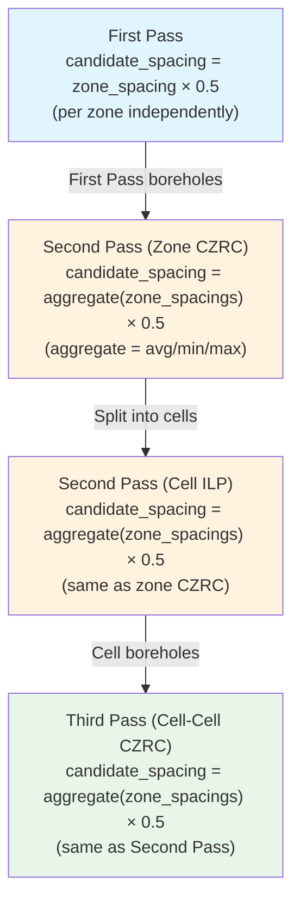

# CZRC Candidate Grid Spacing Analysis

## Executive Summary

This report traces every code path that determines **candidate grid spacing** (the distance between potential borehole locations) in Second Pass (zone-zone CZRC) and Third Pass (cell-cell CZRC). It identifies how spacing is computed, which config keys control it, and highlights asymmetries and potential issues.

---

## 1. First Pass Baseline (for reference)

### Code Path

[solver_orchestration.py](../solvers/solver_orchestration.py#L555-L581) → `_optimize_by_zone_decomposition()`

### Formula

```
candidate_spacing = zone_max_spacing_m × candidate_spacing_mult
test_spacing      = zone_max_spacing_m × test_spacing_mult
```

### Config Keys

| Key                      | Location               | Default | Description              |
| ------------------------ | ---------------------- | ------- | ------------------------ |
| `candidate_spacing_mult` | `CONFIG["ilp_solver"]` | 0.5     | Fraction of zone spacing |
| `test_spacing_mult`      | `CONFIG["ilp_solver"]` | 0.2     | Fraction of zone spacing |

### Behavior

- **Per-zone**: Each zone gets its own `candidate_spacing = zone_spacing × 0.5`
- Example: Zone with 100m spacing → 50m candidate grid; Zone with 200m → 100m candidate grid
- Grid type: hexagonal with `hexagonal_density=1.5`

---

## 2. Second Pass: Zone-Zone CZRC

### 2.1 Candidate Grid Spacing

#### Code Path

[czrc_solver.py `_prepare_candidates_for_ilp()`](../solvers/czrc_solver.py#L1002-L1055)

#### Formula

```python
candidate_mult = config.get("candidate_grid_spacing_mult", 0.5)
candidate_spacing = min_zone_spacing × candidate_mult
```

Where `min_zone_spacing` is computed by `_aggregate_zone_spacings()`:

#### How `min_zone_spacing` is Determined

**For per-pair solves** ([czrc_solver.py L1430-L1432](../solvers/czrc_solver.py#L1430-L1432)):
```python
zones = parse_pair_key(pair_key, zone_spacings)
exclusion_method = _get_cross_zone_exclusion_method(config)
min_spacing = _aggregate_zone_spacings(zone_spacings, zones, exclusion_method)
```

**For cluster solves** ([czrc_solver.py L3009-L3016](../solvers/czrc_solver.py#L3009-L3016)):
```python
all_zones = set()
for pk in pair_keys:
    all_zones.update(parse_pair_key(pk, zone_spacings))
exclusion_method = _get_cross_zone_exclusion_method(config)
min_spacing = _aggregate_zone_spacings(zone_spacings, list(all_zones), exclusion_method)
```

#### Aggregation Methods (`_aggregate_zone_spacings`)

[czrc_solver.py L506-L546](../solvers/czrc_solver.py#L506-L546):

| Method      | Formula               | Effect on Grid              |
| ----------- | --------------------- | --------------------------- |
| `"min"`     | `min(zone_spacings)`  | Densest grid (conservative) |
| `"max"`     | `max(zone_spacings)`  | Sparsest grid (aggressive)  |
| `"average"` | `mean(zone_spacings)` | Balanced (default)          |

The method is resolved via `_get_cross_zone_exclusion_method()`:
1. Check `czrc_optimization.ilp.cross_zone_exclusion_method` (CZRC-specific override)
2. Fall back to `ilp_solver.cross_zone_exclusion_method` (global)
3. Default: `"average"`

#### Config Keys

| Key                           | Location                             | Default             | Description                    |
| ----------------------------- | ------------------------------------ | ------------------- | ------------------------------ |
| `candidate_grid_spacing_mult` | `CONFIG["czrc_optimization"]`        | 0.5                 | Fraction of aggregated spacing |
| `cross_zone_exclusion_method` | `CONFIG["czrc_optimization"]["ilp"]` | `None` (→ inherits) | Aggregation method             |
| `cross_zone_exclusion_method` | `CONFIG["ilp_solver"]`               | `"average"`         | Global aggregation method      |

#### Concrete Example

Zones: Embankment 100m, Highway 200m
- `"average"` → `min_zone_spacing = 150m` → `candidate_spacing = 75m`
- `"min"` → `min_zone_spacing = 100m` → `candidate_spacing = 50m`
- `"max"` → `min_zone_spacing = 200m` → `candidate_spacing = 100m`

### 2.2 Grid Generation

[czrc_solver.py L1036-L1044](../solvers/czrc_solver.py#L1036-L1044):
```python
grid_candidates = _generate_candidate_grid(
    gap_polys=tier1_polys,
    max_spacing=r_max,            # max(zone spacings) — for search area
    grid_spacing=candidate_spacing, # aggregated × mult — for grid density
    grid_type="hexagonal",
    hexagonal_density=1.5,
    buffer_distance=0,            # Tier 1 is already buffered
)
```

**Critical note**: `max_spacing` (passed as `r_max`) is used by `_generate_candidate_grid` for the buffer distance (set to 0 here). `grid_spacing` (`candidate_spacing`) controls the actual hex grid point-to-point distance.

### 2.3 What `r_max` Is (Not `min_zone_spacing`)

`r_max = max(zone spacings)` from the pair. It's used for:
- Tier 1/Tier 2 buffer expansion
- ILP conflict constraint distance
- Candidate radii (coverage circles)

`min_zone_spacing` (or aggregated spacing) is used for:
- **Candidate grid density** (how far apart candidates are)
- **Candidate radii** in deduplication
- **ILP exclusion distance** computation

### 2.4 Second Pass Candidate Grid vs First Pass

| Aspect       | First Pass                                | Second Pass                                           |
| ------------ | ----------------------------------------- | ----------------------------------------------------- |
| Spacing base | Zone's own `max_spacing_m`                | Aggregated across zones in pair/cluster               |
| Multiplier   | `ilp_solver.candidate_spacing_mult` (0.5) | `czrc_optimization.candidate_grid_spacing_mult` (0.5) |
| Aggregation  | N/A (single zone)                         | `cross_zone_exclusion_method` (average/min/max)       |
| Grid type    | Hexagonal                                 | Hexagonal                                             |
| Density      | 1.5                                       | 1.5                                                   |
| Buffer       | `max_spacing` around gaps                 | 0 (Tier 1 is pre-buffered)                            |

**Key observation**: The multiplier is the same (0.5) but they come from **different config keys**. Changing one does NOT change the other.

---

## 3. Third Pass: Cell-Cell CZRC

### 3.1 Candidate Grid Spacing

#### Code Path Overview

The Third Pass candidate grid spacing is determined in **two places**:

1. **`check_and_split_large_cluster()`** computes `min_grid_spacing` and passes it to `run_cell_czrc_pass()`
2. **`solve_cell_cell_czrc()`** receives `min_grid_spacing` and passes it to `_prepare_candidates_for_ilp()`

#### Formula (after fix in commit b01080b)

[czrc_solver.py L2142-L2152](../solvers/czrc_solver.py#L2142-L2152):
```python
# overall_r_max = max zone spacing (for tier boundaries)
cell_spacing = cluster.get("overall_r_max", 100.0)

# FIX: Use aggregated zone spacings for grid density (same as second pass)
exclusion_method = _get_cross_zone_exclusion_method(config)
all_cluster_zones = set()
for pk in cluster.get("pair_keys", []):
    all_cluster_zones.update(parse_pair_key(pk, zone_spacings))
min_grid_spacing = _aggregate_zone_spacings(
    zone_spacings, list(all_cluster_zones), exclusion_method
)
```

Then in `solve_cell_cell_czrc()` [L2498-L2500](../solvers/czrc_solver.py#L2498-L2500):
```python
grid_density_spacing = min_grid_spacing if min_grid_spacing is not None else spacing
candidates, _ = _prepare_candidates_for_ilp(
    tier1_region, bh_candidates, r_max, grid_density_spacing, config
)
```

Which internally does [L1023-L1024](../solvers/czrc_solver.py#L1023-L1024):
```python
candidate_mult = config.get("candidate_grid_spacing_mult", 0.5)
candidate_spacing = min_zone_spacing × candidate_mult   # min_zone_spacing = grid_density_spacing here
```

#### The Config Lookup Issue

When `_prepare_candidates_for_ilp` is called from Third Pass (`solve_cell_cell_czrc`), the `config` parameter is `cell_czrc_config` — which is the `cell_boundary_consolidation` section. **This section does NOT have `candidate_grid_spacing_mult`**, so it falls back to the default `0.5`.

This works correctly because:
- Third Pass inherits ILP config from its parent `czrc_optimization`
- But `candidate_grid_spacing_mult` is at the top level of `czrc_optimization`, not inside `ilp`
- So the fallback to 0.5 happens to match the configured value

**Potential fragility**: If someone changes `czrc_optimization.candidate_grid_spacing_mult` to 0.3, the Third Pass would still use 0.5 (the hardcoded default).

### 3.2 What Changed in Commit b01080b

**Before**: Third Pass used `cell_spacing = cluster["overall_r_max"]` (the MAX zone spacing) for grid density.

**After**: Third Pass uses `min_grid_spacing = _aggregate_zone_spacings(...)` (aggregated zone spacing, typically average or min).

**Impact**: For clusters spanning zones with different spacings (e.g., 100m and 200m):
- Before: `candidate_spacing = 200 × 0.5 = 100m` (too sparse)
- After (average): `candidate_spacing = 150 × 0.5 = 75m` (matched to Second Pass)
- After (min): `candidate_spacing = 100 × 0.5 = 50m` (densest)

### 3.3 `spacing` vs `min_grid_spacing` in Third Pass

Third Pass has **two spacing values** with different purposes:

| Variable                   | Value                                         | Used For                                                   |
| -------------------------- | --------------------------------------------- | ---------------------------------------------------------- |
| `spacing` (`cell_spacing`) | `cluster["overall_r_max"]` = max zone spacing | Tier boundaries, coverage radius, ILP conflict distance    |
| `min_grid_spacing`         | Aggregated zone spacing (avg/min/max)         | Candidate grid density (via `_prepare_candidates_for_ilp`) |

This mirrors Second Pass exactly:
- `r_max` = max(zone spacings) → tier expansion, conflict constraints
- `min_spacing` = aggregated → candidate grid density

### 3.4 Per-Cell Second Pass Candidate Grid

When cells are solved in the Second Pass (before Third Pass), each cell uses the **same** `_prepare_candidates_for_ilp()` function via `solve_czrc_ilp_for_cluster()`. The candidate grid spacing per cell is:

[czrc_solver.py L3009-L3020](../solvers/czrc_solver.py#L3009-L3020):
```python
all_zones = set()
for pk in pair_keys:
    all_zones.update(parse_pair_key(pk, zone_spacings))
exclusion_method = _get_cross_zone_exclusion_method(config)
min_spacing = _aggregate_zone_spacings(zone_spacings, list(all_zones), exclusion_method)
candidates, _ = _prepare_candidates_for_ilp(
    unified_tier1, bh_candidates, overall_r_max, min_spacing, config
)
```

So each cell's Second Pass ILP and the Third Pass cell-cell CZRC use the **same aggregated spacing** for grid density. This is correct — consistency is maintained.

---

## 4. Cell Splitting Threshold (Spacing-Relative Sizing)

### How It Affects Grid Spacing Indirectly

Cell splitting doesn't change the grid spacing formula, but it determines **how large a region** the ILP solves at once. Larger cells = more candidates = slower ILP.

[czrc_solver.py L1873-L1885](../solvers/czrc_solver.py#L1873-L1885):
```python
candidate_mult = config.get("candidate_grid_spacing_mult", 0.5)
candidate_grid_spacing = min_zone_spacing × candidate_mult

sr = cell_config.get("spacing_relative", {})
max_area, effective_target = _compute_cluster_cell_thresholds(
    candidate_grid_spacing_m=candidate_grid_spacing,
    base_threshold_m2=base_max_area,
    base_target_area_m2=base_target,
    spacing_relative_config=sr,
)
```

[cell_sizing.py](../solvers/cell_sizing.py#L26-L75):
```
effective_threshold = max(base_threshold, M × candidate_spacing²)
effective_target    = max(base_target,    K × candidate_spacing²)
```

Where K=200, M=400 by default.

### Example

Zone spacing 200m → `candidate_spacing = 100m`:
- `effective_threshold = max(1,000,000, 400 × 100² = 4,000,000)` = 4 km²
- `effective_target = max(1,000,000, 200 × 100² = 2,000,000)` = 2 km²

Zone spacing 100m → `candidate_spacing = 50m`:
- `effective_threshold = max(1,000,000, 400 × 50² = 1,000,000)` = 1 km²
- `effective_target = max(1,000,000, 200 × 50² = 500,000)` = 1 km² (base wins)

This correctly scales cell size with spacing — larger spacing zones get larger cells.

---

## 5. Summary: All Grid Spacing Formulas



| Pass                 | Spacing Base                 | Multiplier Config Key                           | Default | Aggregation                   |
| -------------------- | ---------------------------- | ----------------------------------------------- | ------- | ----------------------------- |
| **First**            | Zone's own `max_spacing_m`   | `ilp_solver.candidate_spacing_mult`             | 0.5     | N/A                           |
| **Second (pair)**    | `_aggregate_zone_spacings()` | `czrc_optimization.candidate_grid_spacing_mult` | 0.5     | `cross_zone_exclusion_method` |
| **Second (cluster)** | `_aggregate_zone_spacings()` | `czrc_optimization.candidate_grid_spacing_mult` | 0.5     | `cross_zone_exclusion_method` |
| **Third**            | `_aggregate_zone_spacings()` | **hardcoded fallback 0.5** (see issue below)    | 0.5     | `cross_zone_exclusion_method` |

---

## 6. Issues & Observations

### 6.1 Third Pass Config Key Missing (Low Severity)

**Issue**: `_prepare_candidates_for_ilp()` reads `candidate_grid_spacing_mult` from its `config` parameter. When called from Third Pass, `config` is `cell_boundary_consolidation` which doesn't contain this key. It falls back to the hardcoded default 0.5.

**Risk**: If `czrc_optimization.candidate_grid_spacing_mult` is changed from 0.5, Third Pass won't reflect the change.

**Fix**: Either:
1. Inherit `candidate_grid_spacing_mult` into `cell_boundary_consolidation` config
2. Pass `candidate_grid_spacing_mult` explicitly from the parent config

### 6.2 Naming: `min_zone_spacing` Is Misleading (Low Severity)

In `_prepare_candidates_for_ilp()`, the parameter `min_zone_spacing` actually receives the **aggregated** spacing (which could be average, min, or max depending on config). The name suggests it's always the minimum.

### 6.3 Double Computation of `min_zone_spacing` and `candidate_mult` (Code Smell)

In `check_and_split_large_cluster()`, `min_zone_spacing` and `candidate_mult` are computed **twice** — once for cell threshold computation (L1871-L1873) and again for K-means sample grid (L1917-L1919). This is a minor code duplication.

### 6.4 Deprecated Border Buffer Uses Different Multiplier

The deprecated `consolidation.py:consolidate_boreholes_buffer_zone()` uses `candidate_spacing_mult` from `ilp_solver` (0.5), not from `czrc_optimization`. This creates inconsistency if the two values ever diverge. However, since this is deprecated, it's not critical.

### 6.5 Coverage Radius vs Grid Spacing Distinction

A subtle but important distinction throughout:
- **Grid spacing** (`candidate_spacing`): Controls distance between candidate hex grid points
- **Coverage radius** (passed to ILP): Controls the maximum distance a borehole can "cover" a test point
- **ILP exclusion distance**: Controls minimum spacing between selected boreholes

In Second Pass, `min_zone_spacing` is used for both grid spacing base AND candidate radii in deduplication. In the ILP itself, coverage is per-test-point (`required_radius`), which is correct.

### 6.6 `hexagonal_density` Hardcoded to 1.5

All three passes use `hexagonal_density=1.5`. This is hardcoded in `_prepare_candidates_for_ilp()` and not configurable per-pass. This is likely intentional (consistent grid density) but worth noting.

---

## 7. Test Point Spacing (For Completeness)

Test point spacing follows a different path but is worth documenting:

| Context                 | Formula                                                           | Notes                             |
| ----------------------- | ----------------------------------------------------------------- | --------------------------------- |
| First Pass              | `zone_spacing × test_spacing_mult (0.2)`                          | Per-zone                          |
| Second Pass Tier 1      | **Reused from First Pass**                                        | No regeneration                   |
| Second Pass Tier 2 ring | `test_spacing_mult × tier2_test_spacing_multiplier × max_spacing` | Sparser (2-3×)                    |
| Third Pass Tier 1       | **Reused from First Pass** (filtered spatially)                   | Same as Second Pass               |
| Third Pass Tier 2 ring  | Same formula as Second Pass Tier 2                                | Generated fresh                   |
| Coverage cloud grid     | `spacing × test_spacing_mult (0.2)`                               | Used in `detect_cell_adjacencies` |

---

## 8. Recommendations

1. **Propagate `candidate_grid_spacing_mult` to Third Pass config** — Either inherit from parent or add to `cell_boundary_consolidation` section to prevent silent inconsistency.

2. **Rename `min_zone_spacing` parameter** in `_prepare_candidates_for_ilp()` to `grid_density_spacing` to match its actual semantic meaning (it's not always the minimum).

3. **Consider whether Third Pass should use per-cell spacing** — Currently all cells in a cluster use the same aggregated spacing for candidate grid. If cells span zones with very different spacings, a per-cell spacing might be more appropriate (though this adds complexity).

4. **Add a diagnostic log line** showing the effective candidate grid spacing for each pass, making it easier to verify spacing is correct in production runs.
