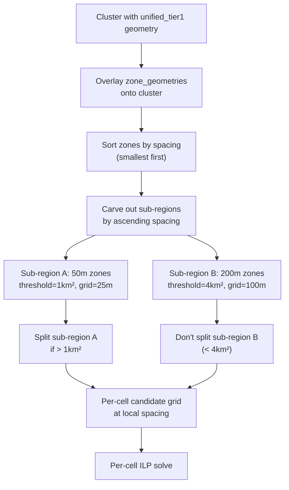

# CZRC Circular Dependency: Cell Splitting, Grid Density & Third Pass Cascading

## Executive Summary

A circular dependency exists between three coupled systems in the CZRC Second/Third Pass:

1. **Cell splitting** — how big cells are  
2. **Candidate grid density** — how many potential borehole positions are generated  
3. **Third Pass boundary count** — how many cell-cell pairs need re-optimization  

All three are driven by **one number**: the smallest zone spacing anywhere in the cluster. This means a single 50m-spacing zone on one side of a cluster forces every cell everywhere — including areas that only contain 200m-spacing zones — to be small, densely gridded, and heavily boundary-ridden.

This report explains the problem in plain English, traces the code, quantifies the impact, and presents two solution options validated by Zen MCP expert analysis.

---

## 1. The Problem in Plain English

### What Happens Today

Imagine a cluster that contains three zones:
- **Embankment** — needs boreholes every 50m (strict)
- **Highways** — needs boreholes every 100m (moderate)  
- **Side Slopes** — needs boreholes every 200m (relaxed)

The system currently does this:

1. **Finds the smallest spacing** across all zones: 50m (from Embankment)
2. **Uses that to set grid density everywhere**: candidate spacing = 50m × 0.5 = 25m. This 25m grid is stamped across the *entire* cluster, including the Side Slopes area 2km away from any Embankment zone.
3. **Uses that to decide cell sizes**: because a 25m grid generates lots of candidates, the system splits the cluster into small 1 km² cells to keep each ILP problem tractable.
4. **After splitting, changes nothing**: each cell still thinks it needs a 25m grid, because the zone spacings dict passed to each cell contains ALL zones (not just the ones that actually overlap that cell).

### Why This Is Wrong

A cell that sits entirely within Side Slopes (200m spacing) should:
- Have a candidate grid at 100m spacing (200 × 0.5), not 25m
- Be ~2 km² (or not need splitting at all if < 4 km²), not 1 km²
- Generate ~160 candidates, not ~2500

Instead, it gets 16× more candidates than needed, is split into cells that are 2-4× too small, and creates unnecessary cell boundaries.

### The Cascade Into Third Pass

Too many small cells → too many cell boundaries close together → Third Pass has to process many adjacent cell pairs → each pair's ILP solution affects the next → effectively one big interconnected optimization problem solved greedily instead of properly.

With 6 cells: ~10 adjacencies (manageable)  
With 10 cells: ~20 adjacencies (problematic)  
With 3 cells (correct sizing): ~3 adjacencies (ideal)

---

## 2. Code Path Trace

### 2.1 Where the Min Is Computed

`check_and_split_large_cluster()` at line 1862:

```python
min_zone_spacing = min(zone_spacings.values()) if zone_spacings else 100.0
candidate_mult = config.get("candidate_grid_spacing_mult", 0.5)
candidate_grid_spacing = min_zone_spacing * candidate_mult
```

This single `min_zone_spacing` feeds into **three** downstream computations:

### 2.2 Cell Split Threshold (Whether to Split)

Lines 1870-1876 — `_compute_cluster_cell_thresholds()`:
```
effective_threshold = max(base_threshold, 400 × candidate_spacing²)
effective_target    = max(base_target,    200 × candidate_spacing²)
```

With 25m spacing: threshold = max(1M, 250k) = **1M m²** (base wins)  
With 100m spacing: threshold = max(1M, 4M) = **4M m²** (scaling wins)

So a 3 km² cluster with only 200m zones would not need splitting at all if using local spacing, but IS split into 3 cells with the current global minimum.

### 2.3 K-means Sample Grid (Cell Shapes)

Lines 1918-1930 — generates a sample grid at 25m everywhere for K-means seed placement. This means cells are shaped by a globally-dense grid, biasing their boundaries.

### 2.4 Per-Cell ILP Solve (Grid Density)

`solve_czrc_ilp_for_cluster()` lines 2987-2990:
```python
all_zones = set()
for pk in pair_keys:
    all_zones.update(parse_pair_key(pk, zone_spacings))
min_spacing = _aggregate_zone_spacings(zone_spacings, list(all_zones), method)
```

After splitting, this function is called for each cell — but `zone_spacings` is the **full cluster dict** and `pair_keys` are the **full cluster's pair keys**. The cell has no awareness of which zones actually overlap it.

### 2.5 Third Pass Inheritance

Lines 2132-2147 — Third Pass `min_grid_spacing` uses the same cluster-wide aggregation.

---

## 3. Quantified Impact

| Scenario | Cell Threshold | Target Cell Area | Grid Spacing | Candidates per km² | Cells for 6 km² |
|---|---|---|---|---|---|
| Current (min=50m) | 1 km² | 1 km² | 25m | ~1600 | 6 cells |
| Local=100m zones | 1 km² | 1 km² | 50m | ~400 | 6 cells |
| Local=200m zones | 4 km² | 2 km² | 100m | ~100 | 3 cells |
| Local=400m zones | 16 km² | 8 km² | 200m | ~25 | 1 cell |

Third Pass adjacency count:
- 6 cells → ~10 pairs → 10 sequential ILP solves  
- 3 cells → ~3 pairs → 3 sequential ILP solves  
- 1 cell → 0 pairs → no Third Pass needed

---

## 4. Available Data

The good news: everything needed is already available.

`czrc_data` (built in `czrc_geometry.py` lines 398-401) contains:

```python
zone_geometries = {zone_name: Shapely_polygon for each zone}  # Raw zone boundaries
zone_spacings   = {zone_name: max_spacing_m for each zone}     # Zone spacings
```

Intersecting a cell polygon with zone geometries is a cheap Shapely operation. We can determine exactly which zones affect each cell.

---

## 5. Two Solution Options

### Option A: Zone-Aware Pre-Partitioning (Recommended by Zen MCP)

**Idea**: Before any cell splitting, divide the cluster into sub-regions based on which zones are present. Each sub-region gets its own splitting threshold, target cell area, and grid density.

**How it works**:



**Algorithm** (`calculate_local_spacing_regions`):

1. Intersect each zone's geometry with the cluster polygon
2. Sort zones by spacing ascending (50m first, 200m last)
3. Work through zones from smallest spacing:
   - Area covered by this zone (within cluster) = sub-region at this spacing
   - Remove that area from remaining cluster (so it's not double-counted)
   - This correctly assigns the **minimum** spacing to overlapping areas
4. Any remaining area (not covered by any zone) gets a large default spacing
5. Return list of (sub_region_polygon, local_spacing) tuples

**Each sub-region then**:
- Computes own threshold/target from its local spacing
- Decides independently whether to split
- If splitting, generates sample grid at its own density
- Each resulting cell is tagged with its `local_spacing`

**Pros**:
- Cells are correctly sized for their local zone composition
- Fewer cells in large-spacing areas → fewer Third Pass boundaries
- Grid density is right from the start → smaller ILP problems
- Single pass — no iteration needed

**Cons**:
- Geometric operations (intersection, difference) add computation
- Sub-regions may be complex shapes if zone boundaries are irregular
- More complex code in `check_and_split_large_cluster`

### Option B: Iterative Refinement (Simpler)

**Idea**: Do an initial split using average/median spacing (not min), then adjust per-cell.

**How it works**:
1. Use **average(zone_spacings)** for initial K-means sample grid and cell threshold
2. K-means produces cells at reasonable initial sizes
3. For each cell, intersect with zone_geometries to find local zones
4. Compute per-cell local spacing
5. Check: is this cell still too large for its local threshold? If yes, sub-split it.
6. Generate per-cell candidate grid at local spacing
7. Solve per-cell ILP

**Pros**:
- Simpler to implement — mostly changes to existing code
- No explicit geometry partitioning
- Iterative refinement catches edge cases

**Cons**:
- Two rounds of splitting (initial + refinement) — more computation
- Initial cell shapes may not match final needs
- Average spacing is a compromise — may still over-split in some areas

---

## 6. Recommendation

**Option A (Zone-Aware Pre-Partitioning)** is the structurally correct solution. It addresses all three coupled problems simultaneously:

| Problem | How Option A Fixes It |
|---|---|
| Cell sizes too small in large-spacing areas | Each sub-region uses its own threshold |
| Grid too dense in large-spacing cells | Each cell generates grid at local spacing |
| Too many Third Pass boundaries | Fewer cells = fewer adjacencies |
| K-means biased by globally dense grid | Each sub-region has its own sample grid density |

The implementation requires:
1. New function `_compute_local_spacing_regions()` (~30-40 lines)
2. Refactor `check_and_split_large_cluster()` to loop over sub-regions
3. Tag each cell with `local_spacing` attribute
4. Modify `solve_czrc_ilp_for_cluster()` to use cell's local spacing
5. Propagate local spacing to Third Pass

**Estimated effort**: 6-8 hours implementation + 3-4 hours testing

---

## 7. Implementation Sketch

### Core New Function

```python
def _compute_local_spacing_regions(
    cluster_geometry: BaseGeometry,
    zone_geometries: Dict[str, BaseGeometry],
    zone_spacings: Dict[str, float],
) -> List[Tuple[BaseGeometry, float, Dict[str, float]]]:
    """
    Partition cluster into sub-regions by local controlling spacing.
    
    Zones are processed smallest-spacing-first. Each zone's footprint
    within the cluster is assigned that zone's spacing. Overlapping areas
    get the smallest spacing (processed first = wins).
    
    Returns:
        List of (sub_region_geometry, controlling_spacing, local_zone_spacings)
    """
    # 1. Get zones that actually intersect cluster
    relevant = []
    for name, geom in zone_geometries.items():
        if cluster_geometry.intersects(geom):
            relevant.append((name, geom, zone_spacings.get(name, 100.0)))
    
    # 2. Sort by spacing ascending (smallest first)
    relevant.sort(key=lambda x: x[2])
    
    # 3. Carve out sub-regions
    remaining = cluster_geometry
    sub_regions = []
    
    for name, geom, spacing in relevant:
        intersection = remaining.intersection(geom)
        if not intersection.is_empty and intersection.area > 100:
            local_spacings = {name: spacing}
            # Also check if other zones overlap this sub-region
            for other_name, other_geom, other_spacing in relevant:
                if other_name != name and intersection.intersects(other_geom):
                    local_spacings[other_name] = other_spacing
            sub_regions.append((intersection, spacing, local_spacings))
            remaining = remaining.difference(geom)
            if remaining.is_empty:
                break
    
    # 4. Handle uncovered area
    if not remaining.is_empty and remaining.area > 100:
        fallback_spacing = max(zone_spacings.values()) if zone_spacings else 200.0
        sub_regions.append((remaining, fallback_spacing, zone_spacings))
    
    return sub_regions
```

### Modified Split Flow

```python
# In check_and_split_large_cluster(), replace L1862-1940:
sub_regions = _compute_local_spacing_regions(
    unified_tier1, zone_geometries, zone_spacings
)

all_cells = []
for sub_region, local_spacing, local_zone_spacings in sub_regions:
    local_candidate_spacing = local_spacing * candidate_mult
    local_threshold, local_target = _compute_cluster_cell_thresholds(
        local_candidate_spacing, base_max_area, base_target, sr
    )
    
    if sub_region.area <= local_threshold:
        # No split needed for this sub-region
        all_cells.append((sub_region, local_spacing, local_zone_spacings))
    else:
        # Split this sub-region at its own density
        sample_grid = _generate_candidate_grid(...)  # at local_candidate_spacing
        voronoi_cells = split_into_voronoi_cells(sub_region, sample_grid, ...)
        for cell in voronoi_cells:
            all_cells.append((cell, local_spacing, local_zone_spacings))
```

---

## 8. Appendix: Key Code Locations

| Component | File | Line(s) |
|---|---|---|
| Cluster formation (union-find) | czrc_solver.py | 904-1000 |
| Zone spacing aggregation | czrc_solver.py | 506-546 |
| Cell split decision + threshold | czrc_solver.py | 1817-1900 |
| Spacing-relative cell sizing | cell_sizing.py | Full file |
| K-means sample grid generation | czrc_solver.py | 1910-1940 |
| Per-cell ILP solve (spacing aggregation) | czrc_solver.py | 2987-2990 |
| Third Pass spacing inheritance | czrc_solver.py | 2132-2147 |
| Third Pass adjacency detection | czrc_solver.py | 2228-2312 |
| Cell count determination | voronoi_splitter.py | 62-80 |
| Zone geometries source | czrc_geometry.py | 398-401 |
| Zone spacings source | czrc_geometry.py | 395-397 |
