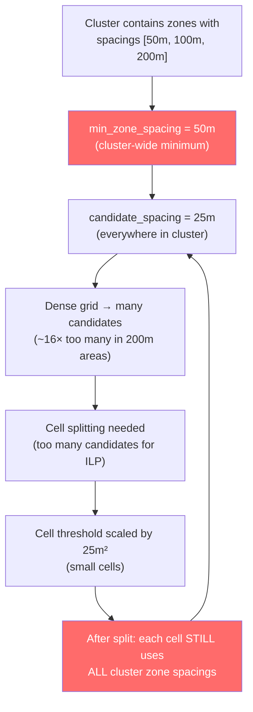

# CZRC Circular Dependency: Cell Splitting & Candidate Grid Density

## Executive Summary

A fundamental circular dependency exists between cell splitting thresholds and candidate grid density in the CZRC Second/Third Pass optimization. Both parameters are computed from a **cluster-wide** `min_zone_spacing`, causing areas that only overlap with large-spacing zones to receive unnecessarily dense grids and small cells. This analysis traces the exact code paths, quantifies the impact, and presents a recommended architectural solution (validated by Zen MCP expert analysis).

---

## 1. Problem Statement

### The Two Coupled Parameters

**Parameter 1 — Candidate Grid Spacing** (`czrc_solver.py` L1862-1863, L1002-1060):
```
min_zone_spacing = min(zone_spacings.values())   # e.g., 50m
candidate_grid_spacing = min_zone_spacing × 0.5   # = 25m EVERYWHERE
```

**Parameter 2 — Cell Split Thresholds** (`czrc_solver.py` L1870-1876, `cell_sizing.py`):
```
effective_threshold = max(base_threshold, M × spacing²)   # M=400
effective_target = max(base_target, K × spacing²)          # K=200
```

Both use the **same** `min_zone_spacing × 0.5` as input. The min is taken across **ALL** zones in the cluster, not just zones local to any particular cell.

### The Vicious Cycle



### Concrete Impact

| Zone Overlap | Ideal Spacing | Actual Spacing | Candidate Density Ratio |
|---|---|---|---|
| Embankment only (50m) | $50 \times 0.5 = 25\text{m}$ | 25m | 1× (correct) |
| Highways only (100m) | $100 \times 0.5 = 50\text{m}$ | 25m | 4× too dense |
| Side Slopes only (200m) | $200 \times 0.5 = 100\text{m}$ | 25m | 16× too dense |

For a 200m-only area: 16× more candidates = 16× larger ILP problem = slower solve + unnecessary cell splitting.

---

## 2. Code Path Analysis

### 2.1 Cluster Formation (Not the Problem)

`_group_overlapping_pairs()` (L904-1000) uses union-find to group zone pairs whose Tier 1 regions overlap. This correctly groups geographically related zones. The problem is **downstream** — how the cluster's zone spacings are consumed.

### 2.2 Cell Splitting Decision — `check_and_split_large_cluster()` (L1817-2020)

**Line 1862-1863** — The root cause:
```python
min_zone_spacing = min(zone_spacings.values()) if zone_spacings else 100.0
candidate_mult = config.get("candidate_grid_spacing_mult", 0.5)
candidate_grid_spacing = min_zone_spacing * candidate_mult
```

This `candidate_grid_spacing` is then used for:
1. **Threshold scaling** (L1870-1876): `_compute_cluster_cell_thresholds()` — determines whether to split
2. **K-means sample grid** (L1918-1930): `_generate_candidate_grid()` — determines cell shapes
3. **Target cell area** (L1870-1876): Scales `effective_target` for Voronoi splitting

**Impact**: A cluster with one 50m zone and many 200m zones gets threshold/target/grid all scaled to 25m density.

### 2.3 Per-Cell ILP Solve — `solve_czrc_ilp_for_cluster()` (L2898-3050)

**Line 2987-2990** — The second root cause:
```python
all_zones = set()
for pk in pair_keys:
    all_zones.update(parse_pair_key(pk, zone_spacings))
exclusion_method = _get_cross_zone_exclusion_method(config)
min_spacing = _aggregate_zone_spacings(zone_spacings, list(all_zones), exclusion_method)
```

After splitting into cells, `solve_czrc_ilp_for_cluster()` is called for each cell with a **cell_cluster** dict. But the `zone_spacings` passed is the **full cluster's zone_spacings dict**, and `pair_keys` are the full cluster's pair keys. The cell-level call aggregates ALL zones, not just those overlapping this cell.

### 2.4 Third Pass Inheritance (L2132-2147)

```python
min_grid_spacing = _aggregate_zone_spacings(
    zone_spacings, list(all_cluster_zones), exclusion_method
)
```

Third Pass also uses cluster-wide aggregation. The recent fix (commit `b01080b`) changed this from `max` to `aggregated`, which improves things but doesn't address locality.

### 2.5 Available Data for the Solution

`czrc_data` (from `czrc_geometry.py` L398-401) already contains:
```python
zone_geometries = {
    row["zone_name"]: row["geometry"] for _, row in zones_gdf.iterrows()
}
```

This dict maps zone names to Shapely polygons (raw zone boundaries). Spatial intersection with cell geometries is straightforward and cheap.

---

## 3. Approaches Evaluated

### Approach A: Per-Cell Zone Detection (Post-Split, Deferred Grid)
1. Split cells using spacing-**agnostic** threshold (pure area-based)
2. For each cell, intersect with `zone_geometries` to find overlapping zones
3. Compute per-cell spacing from only overlapping zones
4. Generate per-cell candidate grid at local spacing

| Pros | Cons |
|---|---|
| Simple mental model | Cell threshold no longer scales with spacing |
| Accurate per-cell grids | Needs zone_geometries plumbed to cell level |
| zone_geometries already available | |

### Approach B: Two-Phase Splitting
1. Generate COARSE grid at `max_zone_spacing × 0.5` for initial K-means
2. After splitting, detect per-cell zones → generate fine per-cell grids

| Pros | Cons |
|---|---|
| Breaks circular dependency | Two grid generations |
| Cell shapes not biased by dense grid | Coarse grid may not capture spatial structure well |

### Approach C: Variable-Density Candidate Grid
Single grid with spatially varying density based on local zone spacing.

| Pros | Cons |
|---|---|
| Single grid generation | Complex to implement |
| Smooth density transitions | Grid transitions may create artifacts |
| No cell sizing changes needed | Still needs zone-cell mapping for density |

### Approach D: Zone-Weighted Aggregation
Weight zone spacings by spatial overlap area for each cell.

| Pros | Cons |
|---|---|
| Smooth transitions | More computation (area calculations) |
| Handles partial overlaps | Still needs zone_geometries at cell level |
| Gradual, not binary | Weighted average may not reflect constraints well |

### Approach E: Split-First-Then-Grid (User's Suggestion)
Split cells first (spacing-independent), then per-cell zone → spacing → grid.

| Pros | Cons |
|---|---|
| Clean separation of concerns | Need good spacing-independent criterion |
| User's preferred direction | Risk of wrong cell sizes |
| No circular dependency | |

---

## 4. Recommended Solution: Hybrid A+E (Split-First with Per-Cell Zone Detection)

### Zen MCP Expert Validation

The Zen MCP expert analysis **confirmed** this as the cleanest solution. Key quotes:

> *"Approach A (per-cell zone detection with post-split deferred grid) combined with E (split first, grid later) is likely the cleanest solution."*

> *"This approach directly addresses the identified issues by localizing spacing computations."*

### Architecture

```mermaid
flowchart TD
    subgraph Current["Current Architecture (Circular)"]
        C1["Cluster zone_spacings"] --> C2["min(all spacings)"]
        C2 --> C3["Cell split threshold"]
        C2 --> C4["K-means sample grid"]
        C2 --> C5["Candidate grid density"]
        C3 --> C6["Split into cells"]
        C6 --> C5
    end
    
    subgraph Proposed["Proposed Architecture (Decoupled)"]
        P1["Cluster area/shape"] --> P2["Split threshold<br/>(spacing-agnostic)"]
        P2 --> P3["Split into cells<br/>(coarse K-means or area)"]
        P3 --> P4["Per-cell: intersect with<br/>zone_geometries"]
        P4 --> P5["Per-cell: local zone spacings"]
        P5 --> P6["Per-cell: candidate grid<br/>at local density"]
        P5 --> P7["Per-cell: ILP solve<br/>with local spacing"]
    end
    
    style C2 fill:#ff6b6b,color:#fff
    style C5 fill:#ff6b6b,color:#fff
    style P4 fill:#4ecdc4,color:#fff
    style P5 fill:#4ecdc4,color:#fff
```



### Implementation Plan

#### Step 1: Decouple Cell Split Threshold

**File**: `czrc_solver.py`, `check_and_split_large_cluster()` (L1862)

Replace:
```python
min_zone_spacing = min(zone_spacings.values()) if zone_spacings else 100.0
candidate_mult = config.get("candidate_grid_spacing_mult", 0.5)
candidate_grid_spacing = min_zone_spacing * candidate_mult
```

With a spacing-agnostic threshold. Options:
- **Option 1 (Simple)**: Use base `max_area_for_direct_ilp_m2` without spacing-relative scaling. Cell splitting is purely area-based.
- **Option 2 (Better)**: Use `average(zone_spacings)` for threshold scaling, which is less skewed by outlier zones.
- **Option 3 (Best)**: Use the **median** zone spacing for a robust central estimate.

#### Step 2: Decouple K-means Sample Grid

**File**: `czrc_solver.py`, `check_and_split_large_cluster()` (L1918-1930)

Replace `sample_spacing = min_zone_spacing * candidate_mult` with a coarser, spacing-agnostic density:
- Use `average(zone_spacings) × candidate_mult` or `max(zone_spacings) × candidate_mult`
- The sample grid only needs to capture spatial structure, not match final ILP density

#### Step 3: Pass `zone_geometries` to Cell Processing

**File**: `czrc_solver.py`, `check_and_split_large_cluster()` 

Add `zone_geometries` parameter. This is already available in `czrc_data` (via `czrc_geometry.py` L398).

Plumbing: `run_czrc_optimization()` → `check_and_split_large_cluster()` → per-cell processing

#### Step 4: Per-Cell Zone Detection

**New function** (add to `czrc_solver.py` or `czrc_geometry.py`):

```python
def _compute_local_zone_spacings(
    cell_geometry: BaseGeometry,
    zone_geometries: Dict[str, BaseGeometry],
    zone_spacings: Dict[str, float],
) -> Dict[str, float]:
    """Determine which zones overlap a cell and return their spacings."""
    local_spacings = {}
    for zone_name, zone_geom in zone_geometries.items():
        if cell_geometry.intersects(zone_geom):
            local_spacings[zone_name] = zone_spacings[zone_name]
    return local_spacings if local_spacings else zone_spacings  # Fallback to all
```

#### Step 5: Per-Cell Grid Generation

Modify `solve_czrc_ilp_for_cluster()` to accept optional `local_zone_spacings`:

```python
# Instead of aggregating ALL zones:
if local_zone_spacings is not None:
    min_spacing = _aggregate_zone_spacings(
        local_zone_spacings, list(local_zone_spacings.keys()), method
    )
else:
    # Existing behavior (fallback)
    min_spacing = _aggregate_zone_spacings(zone_spacings, list(all_zones), method)
```

#### Step 6: Third Pass Locality

Update `min_grid_spacing` computation (L2132-2147) to use per-cell local spacings rather than cluster-wide aggregation.

### Risk Mitigation

| Risk | Mitigation |
|---|---|
| Cell too large for large-spacing areas (no splitting when needed) | Keep absolute area cap as safety net (e.g., 4 km²) |
| Zone boundary clips cell partially | Use `intersects()` not `within()` — zone counts if ANY overlap |
| No zones intersect cell (edge case) | Fallback to full cluster zone_spacings |
| Cell shapes change with coarser K-means grid | Acceptable — shapes are approximate; precision comes from ILP |

---

## 5. Expected Benefits

| Metric | Before | After |
|---|---|---|
| Candidate count (200m-only cell) | ~2500 (25m grid) | ~160 (100m grid) |
| ILP solve time (200m cell) | ~10-30s | ~0.1-0.5s |
| Cell count (split cluster) | Many small cells | Fewer, appropriately-sized cells |
| Grid memory usage | High (uniform dense) | Low (variable per-cell) |
| Third Pass accuracy | Cluster-wide spacing | Local spacing |

---

## 6. Implementation Complexity Assessment

| Step | Effort | Risk | Files Changed |
|---|---|---|---|
| 1. Decouple threshold | Low | Low | czrc_solver.py |
| 2. Decouple K-means grid | Low | Low | czrc_solver.py |
| 3. Plumb zone_geometries | Medium | Low | czrc_solver.py, run_czrc_optimization |
| 4. Per-cell zone detection | Low | Low | czrc_solver.py or czrc_geometry.py (new function) |
| 5. Per-cell grid generation | Medium | Medium | czrc_solver.py (solve_czrc_ilp_for_cluster) |
| 6. Third Pass locality | Low | Low | czrc_solver.py (check_and_split_large_cluster) |

**Total estimated effort**: 4-6 hours implementation + 2-3 hours testing

---

## 7. Appendix: Key Code Locations

| Component | File | Line(s) |
|---|---|---|
| Cluster formation (union-find) | czrc_solver.py | 904-1000 |
| Zone spacing aggregation | czrc_solver.py | 506-546 |
| Cell split decision + threshold | czrc_solver.py | 1817-1900 |
| K-means sample grid generation | czrc_solver.py | 1910-1940 |
| Per-cell ILP solve (spacing aggregation) | czrc_solver.py | 2987-2990 |
| Candidate grid generation | czrc_solver.py → optimization_geometry.py | 1002-1060, 166-270 |
| Cell split threshold scaling | cell_sizing.py | Full file |
| Third Pass spacing inheritance | czrc_solver.py | 2132-2147 |
| Zone geometries available | czrc_geometry.py | 398-401 |
| Zone spacings dict | czrc_geometry.py | 395-397 |
