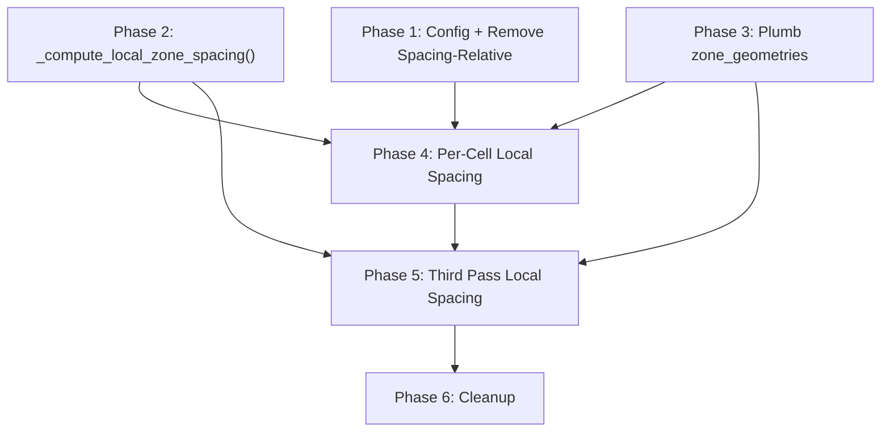

# Phased Implementation Plan: Area-Based Second Pass Cell Splitting

## Overview

Remove spacing-relative cell sizing from Second Pass. Replace with:
- **Purely area-based cell splitting** (static 4 km² threshold, 2 km² target)
- **Per-cell local candidate grid density** (from zone_geometries spatial intersection)
- **First Pass unchanged** (keeps spacing-relative sizing)

---

## Phase 1: Config Changes + Remove Spacing-Relative from Second Pass

**Goal:** Make cell splitting purely area-based. No functional dependency on other phases.

### Step 1.1: Update config.py (lines 807-840)

Change three values in `cell_splitting`:

| Key | Old Value | New Value |
|-----|-----------|-----------|
| `max_area_for_direct_ilp_m2` | `1_000_000` | `4_000_000` |
| `spacing_relative.enabled` | `True` | `False` |
| `kmeans_voronoi.target_cell_area_m2` | `1_000_000` | `2_000_000` |

Update comments to explain the rationale.

**Gotcha:** `zone_auto_splitting.spacing_relative` (First Pass, line 774) must NOT be changed. They share the same key name `spacing_relative` but are in different config sections. Double-check you're editing `cell_splitting`, not `zone_auto_splitting`.

### Step 1.2: Simplify threshold computation in `check_and_split_large_cluster()` (lines 1865-1884)

Replace the spacing-relative threshold computation with direct use of config values:

```python
# BEFORE (lines 1865-1884):
min_zone_spacing = min(zone_spacings.values()) if zone_spacings else 100.0
candidate_mult = config.get("candidate_grid_spacing_mult", 0.5)
candidate_grid_spacing = min_zone_spacing * candidate_mult
sr = cell_config.get("spacing_relative", {})
max_area, effective_target = _compute_cluster_cell_thresholds(
    candidate_grid_spacing_m=candidate_grid_spacing,
    base_threshold_m2=base_max_area,
    base_target_area_m2=base_target,
    spacing_relative_config=sr,
)

# AFTER:
max_area = base_max_area      # Purely area-based: 4 km² from config
effective_target = base_target  # 2 km² from config
```

Also remove the log block (lines 1879-1884) that prints spacing-relative info.

**Gotcha:** The variable `candidate_grid_spacing` was ALSO used later for the K-means sample grid (line 1920). After removing it here, the K-means section recalculates it independently (line 1918-1919: `min_zone_spacing = min(...)` again). So removing the first calculation is safe.

### Step 1.3: Fix K-means sample grid to use fixed density (lines 1916-1940)

The K-means sample grid generates seed points for cell boundary placement. It currently uses `min(zone_spacings) × 0.5` which creates an unnecessarily dense grid when the cluster contains a small-spacing zone.

Replace with a fixed density derived from the target cell area:

```python
# BEFORE (lines 1918-1920):
min_zone_spacing = min(zone_spacings.values()) if zone_spacings else 100.0
candidate_mult = config.get("candidate_grid_spacing_mult", 0.5)
sample_spacing = min_zone_spacing * candidate_mult

# AFTER:
import math
sample_spacing = math.sqrt(effective_target) / 10.0  # ~141m for 2 km²
```

Also need to set `max_spacing` for the `_generate_candidate_grid()` call. Currently uses `min_zone_spacing` — change to a reasonable default:

```python
# BEFORE (line 1934):
max_spacing=min_zone_spacing,

# AFTER:
max_spacing=sample_spacing * 2,  # Just needs to be > sample_spacing for grid generation
```

**Gotcha:** `_generate_candidate_grid()` uses `max_spacing` only for buffer distance when `buffer_distance > 0`. Since we pass `buffer_distance=0`, the `max_spacing` parameter is NOT used for grid generation — it's passed through but ignored. However, changing it to something reasonable avoids confusion.

**Gotcha:** The `_override_target_cell_area(cell_config, effective_target)` call at line 1945 still works — it creates a config copy with the target. Since `effective_target == base_target`, this is a no-op override, but the function is harmless and keeps the code path consistent.

### Step 1.4: Verification

Run the full pipeline. Expected changes:
- Clusters that were previously kept unsplit due to inflated spacing-relative thresholds may now be split (if > 4 km²)
- Clusters that were split with deflated thresholds may now NOT be split (if ≤ 4 km²)
- Candidate grid density UNCHANGED at this point (still cluster-wide min)

**Test:** Compare cell count and cluster split decisions before/after.

### Dependencies
- None. This phase is self-contained.

### Risk
- Low. Config changes are backwards-compatible (spacing_relative disabled = fall through to base values). Code changes are deletion/simplification only.

---

## Phase 2: New `_compute_local_zone_spacing()` Function

**Goal:** Create the utility function that determines which zones overlap a given geometry.

### Step 2.1: Write `_compute_local_zone_spacing()` (after line 545)

Place it immediately after `_aggregate_zone_spacings()` in the same section, since it's conceptually related.

```python
def _compute_local_zone_spacing(
    region: BaseGeometry,
    zone_geometries: Dict[str, BaseGeometry],
    zone_spacings: Dict[str, float],
    method: str = "min",
) -> float:
```

Logic:
1. For each zone in `zone_geometries`, check `region.intersects(zone_geom)`
2. Collect spacings of overlapping zones
3. Aggregate using `method` (same options as `_aggregate_zone_spacings`)
4. If no zones overlap → fallback to `min(zone_spacings.values())`

### Step 2.2: Write unit test

In `_tests/test_local_zone_spacing.py`:
- Cell inside one zone → returns that zone's spacing
- Cell spanning two zones → returns min (method="min") or average (method="average")
- Cell outside all zones → returns fallback
- Empty zone_geometries → returns fallback

### Dependencies
- None. This is a standalone function with no callers yet.

### Gotchas
- **Shapely `.intersects()` returns True for tangent contact** (shared edge/point). This is actually correct — a cell that touches a zone boundary should consider that zone. If this causes issues, can filter by `intersection.area > min_area_threshold`.
- **zone_geometries values are Shapely geometries** (not WKT). Confirmed: `czrc_geometry.py` line 398 builds them from `row["geometry"]` directly. No deserialization needed.

---

## Phase 3: Plumb `zone_geometries` Through the Call Chain

**Goal:** Make `zone_geometries` available where per-cell local spacing is computed.

### Step 3.1: Extract `zone_geometries` in `run_czrc_optimization()` (line ~3397)

`czrc_data["zone_geometries"]` already contains raw Shapely geometries (built in `czrc_geometry.py` line 398-401). Extract it:

```python
zone_geometries = czrc_data.get("zone_geometries", {})
```

No WKT deserialization needed — the values are already Shapely objects.

### Step 3.2: Add `zone_geometries` parameter to `check_and_split_large_cluster()` (line 1817)

Add as a keyword-only parameter with default None:

```python
def check_and_split_large_cluster(
    cluster: Dict[str, Any],
    zone_spacings: Dict[str, float],
    ...existing params...,
    zone_geometries: Optional[Dict[str, BaseGeometry]] = None,  # NEW
) -> ...:
```

### Step 3.3: Pass `zone_geometries` at the call site (line ~3447)

```python
check_and_split_large_cluster(
    cluster, zone_spacings, ...,
    zone_geometries=zone_geometries,
)
```

### Dependencies
- Phase 2 (`_compute_local_zone_spacing()` must exist before being called in Phase 4)

### Gotchas
- **`check_and_split_large_cluster()` has 10 parameters already.** Adding one more via keyword-only is fine but getting long. Not a blocker — the function signature is already documented with Args docstring.
- **Direct-solve path (line 1895):** When cluster ≤ max_area, `solve_czrc_ilp_for_cluster()` is called directly, bypassing the per-cell loop. The `zone_geometries` parameter is not needed on this path because there are no cells to compute local spacing for. The direct solve uses the existing `_aggregate_zone_spacings()` inside `solve_czrc_ilp_for_cluster()`. 
  - **However:** For a direct-solve cluster, we COULD still use `_compute_local_zone_spacing()` on the cluster geometry itself. This would be more accurate than aggregating across all pair_keys. Consider in Phase 4.

---

## Phase 4: Per-Cell Local Spacing

**Goal:** Each cell's ILP solve uses candidate grid density based on locally overlapping zones.

### Step 4.1: Add `override_min_spacing` parameter to `solve_czrc_ilp_for_cluster()` (line 2898)

```python
def solve_czrc_ilp_for_cluster(
    cluster: Dict[str, Any],
    zone_spacings: Dict[str, float],
    ...existing params...,
    override_min_spacing: Optional[float] = None,  # NEW
) -> ...:
```

At line ~2997, use override when provided:

```python
if override_min_spacing is not None:
    min_spacing = override_min_spacing
else:
    # Existing aggregation logic (unchanged for direct-solve path)
    all_zones = set()
    for pk in pair_keys:
        all_zones.update(parse_pair_key(pk, zone_spacings))
    exclusion_method = _get_cross_zone_exclusion_method(config)
    min_spacing = _aggregate_zone_spacings(
        zone_spacings, list(all_zones), exclusion_method
    )
```

### Step 4.2: Compute local spacing per cell in the loop (line ~1971-1985)

Inside `check_and_split_large_cluster()`, in the per-cell loop:

```python
for i, cell_geom in enumerate(cells):
    cell_cluster = _create_cell_cluster(cell_geom, cluster, i)

    # Compute local zone spacing for this cell
    local_spacing = None
    if zone_geometries:
        exclusion_method = _get_cross_zone_exclusion_method(config)
        local_spacing = _compute_local_zone_spacing(
            cell_geom, zone_geometries, zone_spacings, exclusion_method
        )
        log.info(
            f"   📐 Cell {i}: local_spacing={local_spacing:.0f}m"
        )

    selected, removed, added, stats = solve_czrc_ilp_for_cluster(
        cell_cluster, zone_spacings, ...,
        override_min_spacing=local_spacing,
    )
```

### Step 4.3: Handle direct-solve path (line ~1892-1905)

When cluster ≤ max_area, `solve_czrc_ilp_for_cluster()` is called directly without splitting. Two options:

**Option A (conservative):** Don't pass override. The existing aggregation logic handles it. Behaviour unchanged for unsplit clusters.

**Option B (better):** Also compute local spacing for the cluster geometry:

```python
local_spacing = None
if zone_geometries:
    exclusion_method = _get_cross_zone_exclusion_method(config)
    local_spacing = _compute_local_zone_spacing(
        unified_tier1, zone_geometries, zone_spacings, exclusion_method
    )

return solve_czrc_ilp_for_cluster(
    cluster, zone_spacings, ...,
    override_min_spacing=local_spacing,
)
```

**Recommendation:** Option A first, Option B as follow-up. The direct-solve path already uses `_aggregate_zone_spacings()` which typically returns the same as `_compute_local_zone_spacing()` for unsplit clusters (same zones). The difference only matters for clusters where some pair_keys reference zones that don't actually overlap the cluster geometry — an edge case.

### Step 4.4: Verification

Run the full pipeline with multi-zone clusters. Expected:
- Cells overlapping only large-spacing zones → coarser grid → fewer candidates
- Cells overlapping small-spacing zones → dense grid → same or more candidates
- Total borehole count should change (possibly decrease due to right-sized grids)

**Test:** Log `local_spacing` per cell and compare with cluster-wide `min_spacing`. Look for cells where local_spacing > cluster-wide min (these are the ones benefiting from the change).

### Dependencies
- Phase 2 (`_compute_local_zone_spacing()` function)
- Phase 3 (`zone_geometries` available in `check_and_split_large_cluster()`)

### Gotchas
- **`solve_czrc_ilp_for_cluster()` is called from 3 places:**
  1. Direct solve in `check_and_split_large_cluster()` (line 1895) — Phase 4.3 handles this
  2. Per-cell loop in `check_and_split_large_cluster()` (line 1977) — Phase 4.2 handles this
  3. Nowhere else in the codebase (confirmed by grep)
  
  Both call sites need to pass `override_min_spacing` as a keyword argument. Since default is None, existing calls without it continue to work.

- **`override_min_spacing` affects ONLY candidate grid density** (via `_prepare_candidates_for_ilp()`). It does NOT affect:
  - Coverage radius computation (`_build_coverage_dict_variable_test_radii()` uses per-test-point `required_radius`)
  - Conflict constraints (exclusion radius in ILP uses `min_zone_spacing`)
  - Tier boundary computation (uses `overall_r_max` from cluster)

- **ILP solver tractability:** A cell with local_spacing=200m gets grid at 100m → ~100 candidates per km². A cell with local_spacing=50m gets grid at 25m → ~1600 per km². Within a 2 km² cell, that's ~3200 candidates for the dense case. The ILP solver handles this — the original 1 km² cell threshold was designed for ~400-500 candidates per cell, and with 2 km² and 50m zones we get more. Monitor HiGHS solve times.

---

## Phase 5: Third Pass Local Spacing

**Goal:** Third Pass candidate grid density uses locally-relevant spacing, not cluster-wide min.

### Step 5.1: Update `min_grid_spacing` computation (lines 2126-2139)

Currently:
```python
exclusion_method = _get_cross_zone_exclusion_method(config)
all_cluster_zones: set = set()
for pk in cluster.get("pair_keys", []):
    all_cluster_zones.update(parse_pair_key(pk, zone_spacings))
min_grid_spacing = _aggregate_zone_spacings(
    zone_spacings, list(all_cluster_zones), exclusion_method
)
```

Change to use zone_geometries when available:
```python
if zone_geometries:
    min_grid_spacing = _compute_local_zone_spacing(
        unified_tier1, zone_geometries, zone_spacings, exclusion_method
    )
else:
    min_grid_spacing = _aggregate_zone_spacings(
        zone_spacings, list(all_cluster_zones), exclusion_method
    )
```

### Dependencies
- Phase 2 (`_compute_local_zone_spacing()` function)
- Phase 3 (`zone_geometries` available)

### Gotchas
- **Third Pass does NOT split cells.** It only processes adjacencies between cells already created by Second Pass. The `min_grid_spacing` passed to `run_cell_czrc_pass()` controls candidate grid density WITHIN each Third Pass pair's CZRC region. This is cluster-level, not per-pair.
- **Per-pair local spacing (future enhancement):** For even more accuracy, `zone_geometries` could be plumbed into `run_cell_czrc_pass()` → `solve_cell_cell_czrc()`, and local spacing computed per CZRC region. This is a separate enhancement — the cluster-level approach in Phase 5 is sufficient for now because Third Pass CZRC regions are small boundary strips where zone composition doesn't vary much.
- **`min_grid_spacing` is also used for `cell_spacing`** (line 2128: `cell_spacing = cluster.get("overall_r_max", 100.0)`). Note these are different variables: `cell_spacing` is for tier boundaries, `min_grid_spacing` is for grid density. Don't confuse them.

---

## Phase 6: Cleanup and Documentation

### Step 6.1: Update module docstring in `czrc_solver.py`

Update the architectural overview to reflect that Second Pass uses area-based splitting.

### Step 6.2: Consider removing dead code

After Phase 1, `_compute_cluster_cell_thresholds()` (line 1761) is no longer called from `check_and_split_large_cluster()`. Check if it's called elsewhere:
- It's called from `zone_auto_splitter.py` via `compute_effective_cell_thresholds()` (the underlying function in `cell_sizing.py`).
- The wrapper `_compute_cluster_cell_thresholds()` in `czrc_solver.py` may be dead code after Phase 1. If confirmed, remove it.

Similarly, `_override_target_cell_area()` (line 1793) becomes a no-op when `effective_target == base_target`. It still works correctly — just passes the same value through. Can keep or remove.

### Step 6.3: Update README.md

The README documents the three-pass architecture. Update the cell splitting section to reflect area-based thresholds.

---

## Dependency Graph



Phases 1, 2, and 3 can be implemented in parallel (no inter-dependencies).
Phase 4 requires all three.
Phase 5 requires Phase 4 (uses same function + plumbing).
Phase 6 requires all phases complete.

---

## Summary of All Gotchas

| # | Gotcha | Phase | Severity | Mitigation |
|---|--------|-------|----------|------------|
| 1 | Don't edit `zone_auto_splitting.spacing_relative` (First Pass) — only `cell_splitting.spacing_relative` (Second Pass) | 1 | High | Double-check config section path before editing |
| 2 | `candidate_grid_spacing` variable was used for both threshold AND K-means sample grid — ensure K-means section doesn't reference the deleted variable | 1 | Medium | K-means section recalculates independently (lines 1918-1919) |
| 3 | `_generate_candidate_grid()` `max_spacing` parameter is unused when `buffer_distance=0`, but passing a reasonable value avoids confusion | 1 | Low | Set to `sample_spacing * 2` |
| 4 | `_override_target_cell_area()` becomes a no-op — harmless but potentially confusing | 1 | Low | Keep for now, clean up in Phase 6 |
| 5 | `zone_geometries` are raw Shapely objects, NOT WKT — no deserialization needed | 3 | Medium | Confirmed from `czrc_geometry.py` line 398 |
| 6 | `solve_czrc_ilp_for_cluster()` is called from 2 places — both need `override_min_spacing` | 4 | High | Keyword argument with `None` default ensures backward compatibility |
| 7 | `override_min_spacing` affects only grid density, not coverage radius or conflict constraints | 4 | Medium | Document clearly in parameter docstring |
| 8 | ILP tractability at 2 km² with 50m spacing → ~3200 candidates per cell | 4 | Medium | Monitor HiGHS solve times; may need to reduce threshold for small-spacing zones |
| 9 | Third Pass `cell_spacing` (tier boundaries) vs `min_grid_spacing` (grid density) are different variables | 5 | Medium | Don't conflate them — `cell_spacing` stays as `overall_r_max` |
| 10 | `_compute_cluster_cell_thresholds()` may become dead code after Phase 1 | 6 | Low | Verify no other callers before removing |

---

## Estimated Effort per Phase

| Phase | Description | Effort | Lines Changed |
|-------|------------|--------|---------------|
| 1 | Config + remove spacing-relative | 1 hour | ~20 deleted, ~5 added |
| 2 | `_compute_local_zone_spacing()` + test | 1 hour | ~35 new |
| 3 | Plumb `zone_geometries` | 30 min | ~15 modified |
| 4 | Per-cell local spacing | 1.5 hours | ~25 modified |
| 5 | Third Pass local spacing | 30 min | ~10 modified |
| 6 | Cleanup + docs | 30 min | ~20 deleted/modified |
| **Total** | | **~5 hours** | **~130 lines** |
