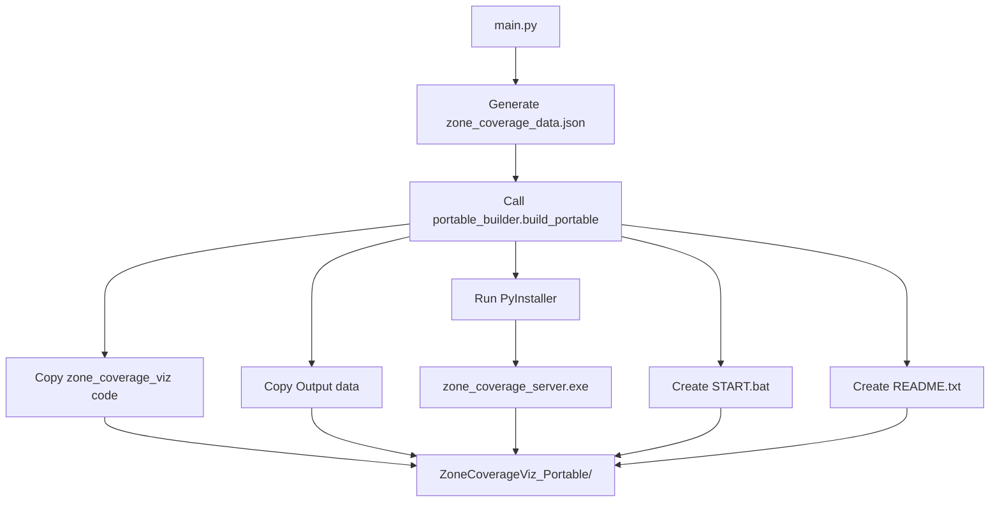

# PyInstaller Bundle Module - Implementation Plan

## Overview

Create a new module `portable_builder.py` that `main.py` calls at the end to generate a portable distribution folder containing:
- Pre-bundled PyInstaller executable
- Current data files
- START.bat launcher
- README for users

## Architecture



## Module Location

```
Main/Gap_Analysis_EC7/
├── main.py                      # Calls portable_builder at end
├── portable_builder.py          # NEW - Build logic
├── zone_coverage_viz/
│   ├── server.py
│   ├── ...
│   └── pyinstaller_spec.py      # NEW - PyInstaller config
└── Output/
    └── zone_coverage_data.json
```

## Output Structure

```
ZoneCoverageViz_Portable/
├── zone_coverage_server.exe     # PyInstaller bundle (~50-100 MB)
├── Output/
│   └── zone_coverage_data.json  # Current data snapshot
├── templates/
│   └── index.html               # Frontend (if not bundled)
├── START.bat                    # Double-click launcher
├── STOP.bat                     # Kill server if needed
└── README.txt                   # User instructions
```

---

## Implementation Steps

### Step 1: Create `portable_builder.py`

**Location:** `Main/Gap_Analysis_EC7/portable_builder.py`

**Responsibilities:**
1. Check if PyInstaller is installed
2. Run PyInstaller to create executable
3. Copy data files to output folder
4. Create batch launchers
5. Create README

**Function signature:**
```python
def build_portable(
    output_dir: str = "ZoneCoverageViz_Portable",
    include_data: bool = True,
    clean_build: bool = True
) -> Path:
    """
    Build a portable distribution of zone_coverage_viz.
    
    Args:
        output_dir: Name of output folder (created in current directory)
        include_data: Whether to copy Output/zone_coverage_data.json
        clean_build: Whether to delete existing output folder first
    
    Returns:
        Path to the created portable folder
    """
```

### Step 2: Create PyInstaller Spec File

**Location:** `Main/Gap_Analysis_EC7/zone_coverage_viz/zone_coverage_server.spec`

**Why a spec file?**
- More control than command-line flags
- Can include data files (templates)
- Reproducible builds
- Can exclude unnecessary dependencies

**Spec file content:**
```python
# zone_coverage_server.spec
# -*- mode: python ; coding: utf-8 -*-

block_cipher = None

# Collect all zone_coverage_viz modules
a = Analysis(
    ['server.py'],
    pathex=[],
    binaries=[],
    datas=[
        ('templates', 'templates'),  # Include HTML templates
    ],
    hiddenimports=[
        'flask',
        'flask_cors',
        'shapely',
        'shapely.geometry',
        'geopandas',
        'pyproj',
        'pandas',
        'fiona',
        'fiona.crs',
    ],
    hookspath=[],
    hooksconfig={},
    runtime_hooks=[],
    excludes=[
        'matplotlib',  # Not needed for server
        'tkinter',
        'PyQt5',
        'notebook',
        'jupyter',
    ],
    win_no_prefer_redirects=False,
    win_private_assemblies=False,
    cipher=block_cipher,
    noarchive=False,
)

pyz = PYZ(a.pure, a.zipped_data, cipher=block_cipher)

exe = EXE(
    pyz,
    a.scripts,
    a.binaries,
    a.zipfiles,
    a.datas,
    [],
    name='zone_coverage_server',
    debug=False,
    bootloader_ignore_signals=False,
    strip=False,
    upx=True,  # Compress if UPX available
    upx_exclude=[],
    runtime_tmpdir=None,
    console=True,  # Show console window for server output
    disable_windowed_traceback=False,
    argv_emulation=False,
    target_arch=None,
    codesign_identity=None,
    entitlements_file=None,
    icon=None,  # Add icon path if desired
)
```

### Step 3: Create START.bat Template

```batch
@echo off
title Zone Coverage Visualization Server
chcp 65001 >nul 2>&1

echo ╔═══════════════════════════════════════════════════════════════╗
echo ║         ZONE COVERAGE VISUALIZATION                           ║
echo ║                                                               ║
echo ║  Starting server... please wait                               ║
echo ║  Browser will open automatically                              ║
echo ║                                                               ║
echo ║  To stop: Close this window or press Ctrl+C                   ║
echo ╚═══════════════════════════════════════════════════════════════╝
echo.

REM Open browser after 2 second delay
start "" cmd /c "timeout /t 2 /nobreak >nul && start http://127.0.0.1:5051"

REM Run the server
"%~dp0zone_coverage_server.exe"

echo.
echo Server stopped.
pause
```

### Step 4: Create STOP.bat Template

```batch
@echo off
echo Stopping Zone Coverage Server...
taskkill /F /IM zone_coverage_server.exe 2>nul
if %ERRORLEVEL% EQU 0 (
    echo Server stopped successfully.
) else (
    echo Server was not running.
)
timeout /t 2 >nul
```

### Step 5: Create README.txt Template

```text
ZONE COVERAGE VISUALIZATION
===========================

QUICK START:
1. Double-click START.bat
2. Wait for browser to open (http://127.0.0.1:5051)
3. Use the map to view/edit borehole positions

TO STOP:
- Close the black command window, OR
- Double-click STOP.bat

FEATURES:
- View zones and borehole positions
- Drag boreholes to new locations
- See coverage update in real-time
- Toggle zone visibility
- Export modified positions to CSV

TROUBLESHOOTING:
- If browser doesn't open: manually go to http://127.0.0.1:5051
- If "port in use" error: run STOP.bat first, then try again
- If blocked by antivirus: add exception for zone_coverage_server.exe

DATA:
- Current data is in Output/zone_coverage_data.json
- To update data, replace this file and restart

Generated: {timestamp}
```

### Step 6: Integration with main.py

**Add to end of main.py:**
```python
# At end of main.py, after all processing

# ═══════════════════════════════════════════════════════════════════════════
# 🚀 PORTABLE BUILD SECTION (Optional)
# ═══════════════════════════════════════════════════════════════════════════

def maybe_build_portable():
    """Build portable distribution if requested."""
    build_portable = CONFIG.get("build_portable", False)
    
    if not build_portable:
        return
    
    try:
        from portable_builder import build_portable as do_build
        
        logger.info("🔧 Building portable distribution...")
        output_path = do_build(
            output_dir="ZoneCoverageViz_Portable",
            include_data=True,
            clean_build=True
        )
        logger.info(f"✅ Portable build created: {output_path}")
        
    except ImportError:
        logger.warning("⚠️ portable_builder module not found, skipping portable build")
    except Exception as e:
        logger.error(f"❌ Portable build failed: {e}")

# Call at end of main
if __name__ == "__main__":
    # ... existing main code ...
    maybe_build_portable()
```

---

## portable_builder.py - Full Implementation

```python
"""
Portable Builder Module
=======================
Creates a standalone portable distribution of zone_coverage_viz.

Usage:
    from portable_builder import build_portable
    build_portable(output_dir="ZoneCoverageViz_Portable")

Requirements:
    pip install pyinstaller
"""

import subprocess
import shutil
import sys
from pathlib import Path
from datetime import datetime
from typing import Optional
import logging

logger = logging.getLogger(__name__)


# ═══════════════════════════════════════════════════════════════════════════
# 📋 CONFIGURATION
# ═══════════════════════════════════════════════════════════════════════════

PYINSTALLER_CMD = [
    sys.executable, "-m", "PyInstaller",
    "--onefile",
    "--name", "zone_coverage_server",
    "--add-data", "templates;templates",
    "--hidden-import", "flask",
    "--hidden-import", "flask_cors", 
    "--hidden-import", "shapely",
    "--hidden-import", "shapely.geometry",
    "--hidden-import", "geopandas",
    "--hidden-import", "pyproj",
    "--hidden-import", "pandas",
    "--hidden-import", "fiona",
    "--console",
    "server.py"
]


# ═══════════════════════════════════════════════════════════════════════════
# 🔧 TEMPLATE CONTENT
# ═══════════════════════════════════════════════════════════════════════════

START_BAT = '''@echo off
title Zone Coverage Visualization Server
chcp 65001 >nul 2>&1

echo.
echo   ZONE COVERAGE VISUALIZATION
echo   ============================
echo.
echo   Starting server... please wait
echo   Browser will open automatically at http://127.0.0.1:5051
echo.
echo   To stop: Close this window or press Ctrl+C
echo.

start "" cmd /c "timeout /t 2 /nobreak >nul && start http://127.0.0.1:5051"

"%~dp0zone_coverage_server.exe"

echo.
echo Server stopped.
pause
'''

STOP_BAT = '''@echo off
echo Stopping Zone Coverage Server...
taskkill /F /IM zone_coverage_server.exe 2>nul
if %ERRORLEVEL% EQU 0 (
    echo Server stopped successfully.
) else (
    echo Server was not running.
)
timeout /t 2 >nul
'''

README_TEMPLATE = '''ZONE COVERAGE VISUALIZATION
===========================

QUICK START:
1. Double-click START.bat
2. Wait for browser to open (http://127.0.0.1:5051)
3. Use the map to view/edit borehole positions

TO STOP:
- Close the black command window, OR
- Double-click STOP.bat

FEATURES:
- View zones and borehole positions on interactive map
- Drag boreholes to new locations
- See coverage update in real-time
- Toggle zone visibility with checkboxes
- Export modified positions to CSV

TROUBLESHOOTING:
- If browser doesn't open: manually go to http://127.0.0.1:5051
- If "port in use" error: run STOP.bat first, then try again
- If blocked by antivirus: add exception for zone_coverage_server.exe
- If SmartScreen warning: click "More info" then "Run anyway"

DATA:
- Current data is in Output/zone_coverage_data.json
- To update data, replace this file and restart the server

Generated: {timestamp}
'''


# ═══════════════════════════════════════════════════════════════════════════
# 🏗️ BUILD FUNCTIONS
# ═══════════════════════════════════════════════════════════════════════════

def check_pyinstaller() -> bool:
    """Check if PyInstaller is installed."""
    try:
        result = subprocess.run(
            [sys.executable, "-m", "PyInstaller", "--version"],
            capture_output=True,
            text=True
        )
        return result.returncode == 0
    except Exception:
        return False


def install_pyinstaller() -> bool:
    """Attempt to install PyInstaller."""
    logger.info("📦 Installing PyInstaller...")
    try:
        result = subprocess.run(
            [sys.executable, "-m", "pip", "install", "pyinstaller"],
            capture_output=True,
            text=True
        )
        return result.returncode == 0
    except Exception as e:
        logger.error(f"Failed to install PyInstaller: {e}")
        return False


def run_pyinstaller(source_dir: Path) -> Optional[Path]:
    """
    Run PyInstaller to create executable.
    
    Args:
        source_dir: Directory containing server.py
        
    Returns:
        Path to created executable, or None if failed
    """
    logger.info("🔨 Running PyInstaller...")
    
    # Run from source directory
    result = subprocess.run(
        PYINSTALLER_CMD,
        cwd=source_dir,
        capture_output=True,
        text=True
    )
    
    if result.returncode != 0:
        logger.error(f"PyInstaller failed:\n{result.stderr}")
        return None
    
    # Find the executable
    exe_path = source_dir / "dist" / "zone_coverage_server.exe"
    if exe_path.exists():
        logger.info(f"✅ Created: {exe_path}")
        return exe_path
    
    logger.error("Executable not found after PyInstaller")
    return None


def build_portable(
    output_dir: str = "ZoneCoverageViz_Portable",
    include_data: bool = True,
    clean_build: bool = True,
    auto_install_pyinstaller: bool = True
) -> Path:
    """
    Build a portable distribution of zone_coverage_viz.
    
    Args:
        output_dir: Name of output folder
        include_data: Whether to copy data files
        clean_build: Whether to clean existing output first
        auto_install_pyinstaller: Install PyInstaller if missing
        
    Returns:
        Path to the created portable folder
        
    Raises:
        RuntimeError: If build fails
    """
    # Resolve paths
    script_dir = Path(__file__).parent.resolve()
    viz_dir = script_dir / "zone_coverage_viz"
    output_path = script_dir / output_dir
    
    logger.info(f"📁 Building portable distribution in: {output_path}")
    
    # === Step 1: Check/Install PyInstaller ===
    if not check_pyinstaller():
        if auto_install_pyinstaller:
            if not install_pyinstaller():
                raise RuntimeError("Failed to install PyInstaller")
        else:
            raise RuntimeError("PyInstaller not installed. Run: pip install pyinstaller")
    
    # === Step 2: Clean output directory ===
    if clean_build and output_path.exists():
        logger.info("🧹 Cleaning existing output directory...")
        shutil.rmtree(output_path)
    
    output_path.mkdir(parents=True, exist_ok=True)
    
    # === Step 3: Run PyInstaller ===
    exe_path = run_pyinstaller(viz_dir)
    if exe_path is None:
        raise RuntimeError("PyInstaller build failed")
    
    # === Step 4: Copy executable to output ===
    shutil.copy2(exe_path, output_path / "zone_coverage_server.exe")
    
    # === Step 5: Copy data files ===
    if include_data:
        data_src = script_dir / "Output" / "zone_coverage_data.json"
        if data_src.exists():
            data_dst = output_path / "Output"
            data_dst.mkdir(exist_ok=True)
            shutil.copy2(data_src, data_dst / "zone_coverage_data.json")
            logger.info("📊 Copied data file")
        else:
            logger.warning(f"⚠️ Data file not found: {data_src}")
    
    # === Step 6: Create batch files ===
    (output_path / "START.bat").write_text(START_BAT, encoding="utf-8")
    (output_path / "STOP.bat").write_text(STOP_BAT, encoding="utf-8")
    logger.info("📝 Created batch launchers")
    
    # === Step 7: Create README ===
    readme_content = README_TEMPLATE.format(
        timestamp=datetime.now().strftime("%Y-%m-%d %H:%M:%S")
    )
    (output_path / "README.txt").write_text(readme_content, encoding="utf-8")
    
    # === Step 8: Clean up PyInstaller artifacts ===
    for cleanup_dir in ["build", "dist", "__pycache__"]:
        cleanup_path = viz_dir / cleanup_dir
        if cleanup_path.exists():
            shutil.rmtree(cleanup_path)
    
    spec_file = viz_dir / "zone_coverage_server.spec"
    if spec_file.exists():
        spec_file.unlink()
    
    logger.info(f"✅ Portable build complete: {output_path}")
    return output_path


# ═══════════════════════════════════════════════════════════════════════════
# 🚀 CLI ENTRY POINT
# ═══════════════════════════════════════════════════════════════════════════

if __name__ == "__main__":
    logging.basicConfig(
        level=logging.INFO,
        format="%(message)s"
    )
    
    import argparse
    parser = argparse.ArgumentParser(description="Build portable zone_coverage_viz")
    parser.add_argument("--output", "-o", default="ZoneCoverageViz_Portable",
                        help="Output directory name")
    parser.add_argument("--no-data", action="store_true",
                        help="Don't include data files")
    parser.add_argument("--no-clean", action="store_true",
                        help="Don't clean existing output")
    
    args = parser.parse_args()
    
    try:
        result = build_portable(
            output_dir=args.output,
            include_data=not args.no_data,
            clean_build=not args.no_clean
        )
        print(f"\n✅ SUCCESS: {result}")
    except Exception as e:
        print(f"\n❌ ERROR: {e}")
        sys.exit(1)
```

---

## Configuration Option

**Add to `shapefile_config.py` or CONFIG:**
```python
CONFIG = {
    # ... existing config ...
    
    # Portable build settings
    "build_portable": False,  # Set True to build after main.py runs
    "portable_output_dir": "ZoneCoverageViz_Portable",
}
```

---

## Usage Options

### Option A: Manual Build (Recommended for Development)
```bash
cd Main/Gap_Analysis_EC7
python portable_builder.py
```

### Option B: Integrated with main.py
```python
# In shapefile_config.py
CONFIG["build_portable"] = True

# Then run main.py normally
python main.py
```

### Option C: Direct Function Call
```python
from portable_builder import build_portable
build_portable(output_dir="MyPortableBuild")
```

---

## Expected Output

After running, you'll have:

```
ZoneCoverageViz_Portable/
├── zone_coverage_server.exe   (50-100 MB)
├── Output/
│   └── zone_coverage_data.json
├── START.bat
├── STOP.bat
└── README.txt
```

**To distribute:** Zip the entire `ZoneCoverageViz_Portable` folder and send to colleagues.

---

## Dependencies to Add

```bash
pip install pyinstaller
```

**Note:** PyInstaller only needs to be installed on your development machine, not on target user machines.

---

## Potential Issues & Solutions

| Issue                   | Solution                                              |
| ----------------------- | ----------------------------------------------------- |
| Large exe size (>100MB) | Add `--exclude` for unused modules (matplotlib, etc.) |
| Missing DLLs            | Use `--collect-all shapely` flag                      |
| Antivirus blocks        | Code sign or provide whitelist instructions           |
| Templates not found     | Ensure `--add-data` includes templates folder         |
| Startup slow            | Normal for PyInstaller (~2-5 sec cold start)          |

---

## Next Steps After Approval

1. [ ] Create `portable_builder.py` with above implementation
2. [ ] Add optional call to `main.py`
3. [ ] Test build process locally
4. [ ] Test executable on clean Windows machine
5. [ ] Document any additional hidden imports needed
6. [ ] Create test package for restricted laptop validation

---

## Questions Before Implementation

1. **Build trigger:** Automatic after every `main.py` run, or manual only?
2. **Output location:** Same folder as `main.py`, or specific location?
3. **Include satellite cache?** Currently ~5MB, could add to size
4. **Icon file:** Want a custom `.ico` for the executable?
